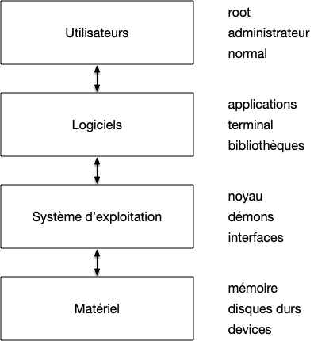
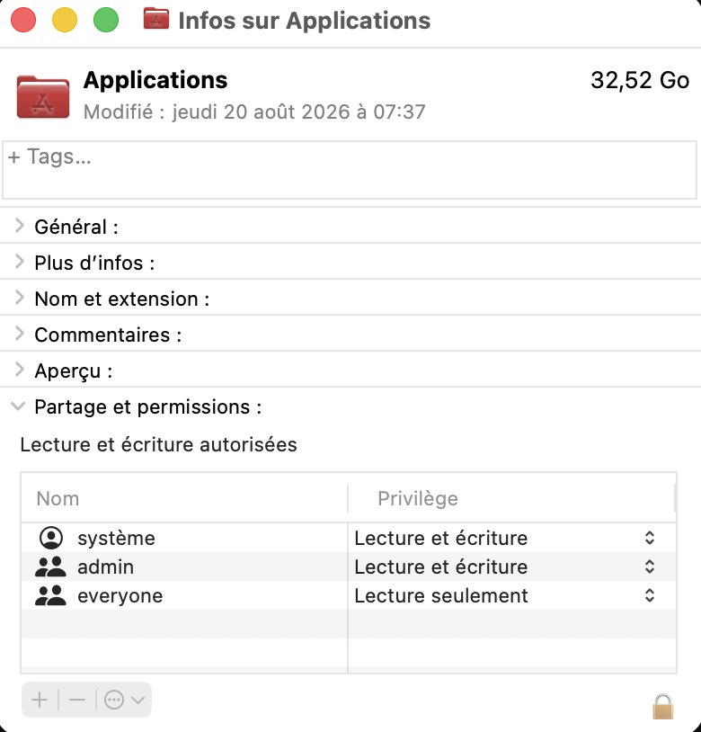
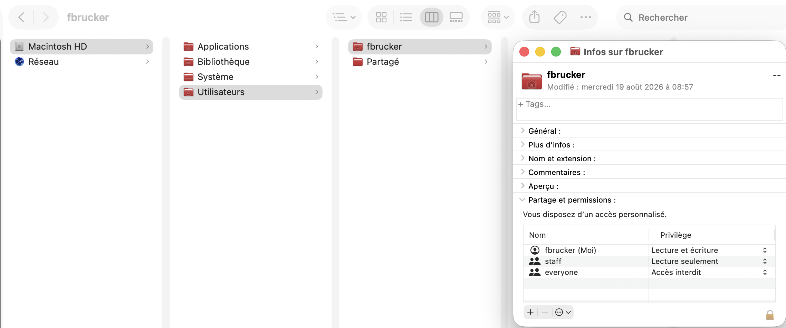

[Nous avons vu](../../ordinateur-programmes-OS/#kernel-user-mode){.interne} que le processeur d'un ordinateur peut être en 2 modes :

- _le kernel mode_ où l'on peut tout faire et qui est réservé au noyau,
- _le user mode_ où l'on ne peut accéder qu'à une partie des instructions et doit effectuer des appels systèmes au noyaux pour effectuer les instructions critiques.

Cependant si tous les process du user mode pouvaient effectuer tous les appels systèmes sans restriction cela poseraient d'énormes problèmes de sécurité (un process pourrait accéder à toute la mémoire, en particulier celle réservée à d'autres process par exemple) c'est pourquoi chaque process n'a qu'un nombre restreint de possibilités (on appelle ceci [des droits](<https://fr.wikipedia.org/wiki/Droit_d%27acc%C3%A8s_(informatique)>)) gérés via la notion d'utilisateurs.


Cette technique de séparation des pouvoirs via des utilisateurs et des droits s'applique aux processus mais aussi aux fichiers/dossiers.


## Utilisateurs et groupes

Du point de vue du système d'exploitation :


Un **_utilisateur_**  un utilisateur est une entité permettant d'exécuter des processus. 

Il peut utiliser uniquement les éléments (logiciel, fichier, dossier, ...) qui lui appartiennent ou qui appartiennent à ses groupes.


L'utilisateur qui se connecte à l'ordinateur au login est donc un parmi beaucoup d'autres, la plupart n'étant pas associé à une personne physique. Les utilisateurs sont ensuite placés dans des groupes, chaque groupe ayant des droits particuliers.


Un utilisateur peut utiliser uniquement les éléments (logiciel, fichier, dossier, ...) qui lui appartiennent ou qui appartiennent à ses groupes.


Il existe de nombreux groupes et utilisateurs utilisés par le système pour segmenter (et donc sécuriser) les utilisations. Parmi eux, un utilisateur et un groupe se détachent car ils ont plus de droit que les autres ce qui est une nouvelle application du [TFIL](../../ordinateur-programmes-OS/#TFIL){.interne}

### Utilisateur `root`


[Le super-utilisateur](https://fr.wikipedia.org/wiki/Utilisateur_root)



L'**_utilisateur `root`_**, aussi appelé **_super utilisateur_** est l'utilisateur lié au système d'exploitation. Comme **Tout** processus a un propriétaire il existe toujours et est le propriétaire des process (démons) et interfaces du système d'exploitation.



Le super-utilisateur a ainsi tous les droits (peut aller partout, réserver autant de mémoire qu'il veut, etc). Il ne faut cependant pas confondre l'utilisateur `root` et les administrateurs.

### Groupe des administrateurs systèmes


[L'administrateur système](https://fr.wikipedia.org/wiki/Administrateur_syst%C3%A8me)



**_Le groupe des administrateurs systèmes_** permet de modifier des paramètres systèmes d'exécuter ou stopper des démons et d'installer de nouveaux logiciels. Ces utilisateurs ont moins de pouvoirs que root qui peut tout faire mais permettent d'administrer le système au quotidien.


Cela permet, si nécessaire, d'installer ou de configurer son système sans être connecté en tant que root. Par exemple :

- en utilisant le paramètre _exécuter en tant qu'administrateur_ sous Windows,
- en utilisant [la commande sudo](https://www.linuxtricks.fr/wiki/sudo-utiliser-et-parametrer-sudoers) sous Linux/macos.

### Utilisateurs et groupes spéciaux

Dans le monde unix, on a coutume d'avoir un utilisateur par type de service et ne correspondent pas à des utilisateurs réels. On trouvera ainsi souvent :

- un utilisateur `web` qui est le propriétaire du processus s'occupant du serveur web et est propriétaire des dossiers réservées aux différents site web,
- un utilisateur `ssh` responsable des connexions sécurisées,
- un utilisateur `lpr` responsable des serveurs d'impressions,
- ...

Outre les utilisateurs spéciaux, on peut regroupe des utilisateur  dans des groupes à périmètre fixé. On a déjà vu le groupe des administrateurs, mais on peut en créer autant qu'on veut et à la demande.

### Utilisateurs "normaux"

Tous les autres utilisateurs qui ne peuvent exécuter que des programmes simples et ne peuvent écrire que dans leur _dossier maison_. Pour un ordinateur personnel ce genre d'utilisateur n'existe plus vraiment puisque l'utilisateur principal est souvent aussi administrateur, mais pour de gros système massivement multi-utilisateur comme la gestion d'une université par exemple c'est très courant.

## Propriété et Droits de fichiers

Du point de vue du système d'exploitation la gestion des droits se fait via les dossiers et les fichiers : 



Les droits d'un processus ou d'un fichier/dossier sont liés à leur **_Le propriétaire_** :

- le propriétaire d'un processus est celui qui l'a lancé :
  - `root` lance le système d'impression, il en est responsable
  - un utilisateur normal lance un jeu, il en est responsable
- le propriétaire d'un fichier/dossier est défini pour chaque fichier



Pour un processus le système d'exploitation décide de ses droits selon le type d'utilisateur de son propriétaire (administrateur, ...). Notez que comme un programme est aussi un fichier, le propriétaire d'un programme est très souvent différent du propriétaire du processus qui exécute le programme. 

Pour un fichier/dossiers, les droits sont déterminés pour chaque utilisateur et sont appelés **_permissions_** :



Chaque fichier et dossiers va accorder à des utilisateur ou groupe d'utilisateur des **_permissions_**. Il y en a trois types :

- **_les droits en lecture_** :
  - pour un fichier : on peut lire le contenu du fichier
  - pour un dossier : on peut connaître la liste de ses fichiers/dossiers qu'il contient
- **_les droits en écriture_** :
  - pour un fichier : on peut modifier le contenu du fichier
  - pour un dossier : on peut ajouter/supprimer des fichiers/dossiers qu'il contient
- **_les droits d'exécution_** :
  - pour un fichier : on peut exécuter le fichier comme un programme (ne fonctionne que si le fichier est bien un programme à la base...)
  - pour un dossier : on peut se déplacer dans ce dossier pour accéder à son contenu (lire ses fichiers si on en a le droit, aller dans un de ses sous-dossiers)



On peut voir les permissions accordés aux différents fichiers via l'explorateur de fichiers. Par exemple le dossier Application de mon mac à les permissions suivantes (clique droit puis lire les information depuis le finder) :

Ces permissions sont différentes de mon dossier Maison :


Notez que la gestion précise des droits des fichiers et des process dépend du système d'exploitation. On reparlera de tout ça de façon détaillée lorsque l'on examinera le système d'exploitation Linux.

