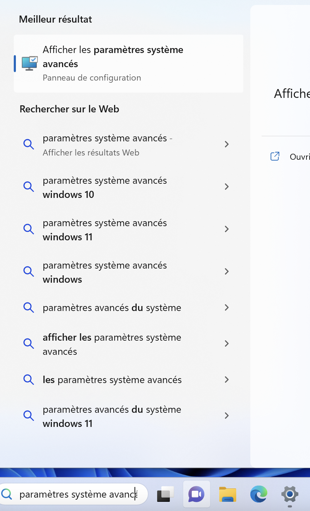
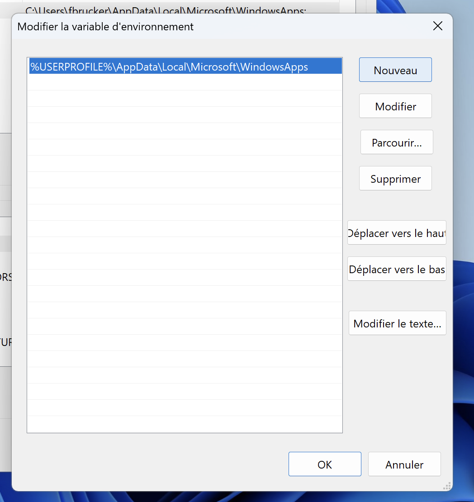
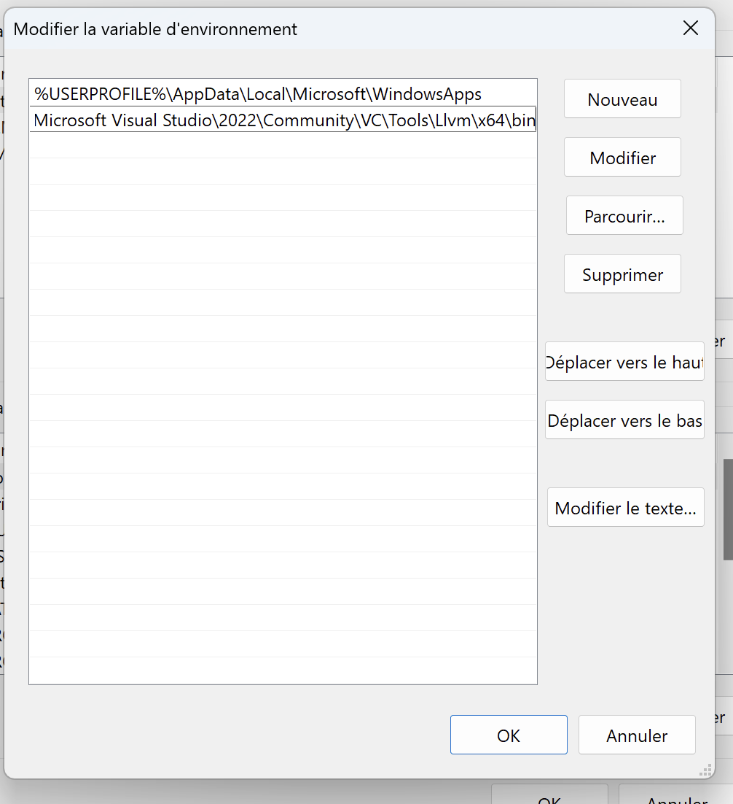

## Linux/Ubuntu

Fonctionne pour une installation native ou sous wsl.

Copiez coller les paquet à installer de la partie default package de la page : <https://apt.llvm.org/>. N'oubliez pas le `sudo` :

```
sudo apt-get install clang-format clang-tidy clang-tools clang clangd libc++-dev libc++1 libc++abi-dev libc++abi1 libclang-dev libclang1 liblldb-dev libllvm-ocaml-dev libomp-dev libomp5 lld lldb llvm-dev llvm-runtime llvm python3-clang
```

Cela devrait installer tout les paquets nécessaires.

## Macos

1. installer [xcode](https://apps.apple.com/us/app/xcode/id497799835?mt=12)
2. installez les _developper tools_ en tapant la commande `xcode-select --install` dans un terminal
3. si vous avez un mac avec une puce arm, il vous faudra peut-être installer Rosetta. Dans un terminal tapez la commande `softwareupdate --install-rosetta`

## Windows 11 Visual Studio

Compilation sous windows. Cela va nécessiter quelques manipulations.

### Installation de visual studio

La plus simple est de télécharger la version 2022 community de visual studio à partir d'ici : <https://visualstudio.microsoft.com/fr/>. Lors de l'installation, choisissez :

- `développement desktop en C++`
- cochez également `Outils C++ Clang pour windows`

Ceci installera l'ide visual studio qui permet de développer des projet en C/C++. Nous n'allons pas utiliser cet ide, on restera avec notre bon vieux visual studio code, mais on va utiliser des programmes que cet IDE installe, en particulier [le compilateur clang](https://clang.llvm.org/)  qui nous permettra de compiler nos programmes C directement avec la ligne de commande.

### Ajout du chemin vers le compilateur au path

dans le dossier d'installation de visual studio. Il faudra ensuite ajouter le dossier contenant le compilateur `clang`  PATH du système qui contient les dossiers contenant les fichiers exécutables indispensables depuis la ligne de commande ou la fenêtre de terminal. cette procédure contient plusieurs étapes :



En le cherchant dans un explorateur de fichier on trouve visual studio rangé dans `program files`{.fichier} :


Ce qui correspond au dossier : `C:\Program Files\Microsoft Visual Studio\2022\Community\VC\Tools\Llvm\x64\bin`{.fichier}

Il est peut-être dans un autre dossier pour vous. Une fois que vous avez trouvé le chemin, cliquez à côté de celui-ci dans l'explorateur de fichier pour avoir le nom exact.




Commencez par ouvrir les paramètres système avancés :



Tapez `paramètres système avancés` dans la barre de recherche puis cliquez dans l'application.






En plusieurs temps :

Il faut commencer par cliquer sur le bouton `variables d'environnements` puis de double-cliquer sur la ligne PATH de la nouvelle fenêtre :






De cette nouvelle fenêtre :



Cliquez sur nouveau puis copiez/collez le chemin vers le dossier contenant `clang` que l'on a précédemment identifié :



Fermez ensuite **toutes** les fenêtres que l'on a ouverte : le nouveau chemin ert ajouté au PATH.


Ne pas oublier de cliquer OK partout, sinon ce n'est pas sauvegardé.




On peut vérifier que le nouveau PATH est opérationnel en ouvrant [une nouvelle fenêtre powershell](/cours/coder-et-développer/ordinateur-développement/terminal/#powershell) et en tapant la commande :

```shell
clang -v
```

Vous devriez obtenir en réponse la version de `clang` installée :


