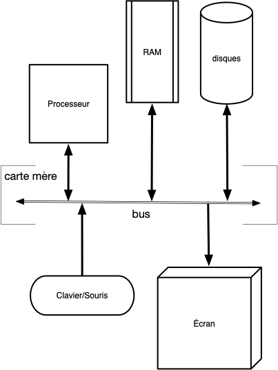
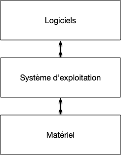
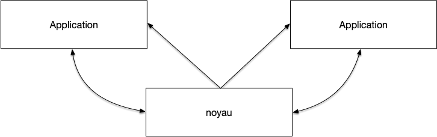

Nous allons présenter ici les principes d'un OS de bureau (W11, Linux Ubuntu, MacOS) actuel.

## Ordinateur

Le but d'un [ordinateur](https://fr.wikipedia.org/wiki/Ordinateur) est de permettre à des utilisateurs d'exécuter des applications :


Un **_ordinateur_** est composé de multiples composants physiques qui interagissent entre eux via [une carte mère](https://fr.wikipedia.org/wiki/Carte_m%C3%A8re) :

- le [**_processeur_**](https://fr.wikipedia.org/wiki/Processeur) qui exécute des instructions sur des variables appelés **_registre_** pouvant contenir 64[bit](https://fr.wikipedia.org/wiki/Bit) d'information (il existe des registres génériques que l'on peut utiliser de façon interchangeable pour de nombreuses instructions et des registres spécialisés dans une tâche bien précise).
- de la mémoire que l'on sépare en 2 grande catégories :
  - [**_la mémoire vive_**](https://fr.wikipedia.org/wiki/M%C3%A9moire_vive) : un espace de stockage rapide, mais volatile (se vide lorsque l'on éteint l'ordinateur). Peut-être vu comme un grand tableau $M$ ou chaque case contient 1[Byte](https://fr.wikipedia.org/wiki/Byte) (un Byte est un entier entre 0 et 255 et est stocké sur 8 bits). Le processeur peut lire 8 Bytes consécutifs de la mémoire et les placer dans un de ses registres ou écrire un de ses registre dans 8 cases consécutives de la mémoire (en fait, ceci n'est possible que pour les adresses multiples de 8 : $M[8\cdot i:8\cdot (i +1)]$ pour tout $i$ pour des raisons d'efficacité). Comme on peut accéder à tout élément de la mémoire sans contrainte, cette mémoire est appelée _RAM_ (pour Random Access Memory)
  - [**_la mémoire de masse_** ou de stockage](https://fr.wikipedia.org/wiki/M%C3%A9moire_de_masse), non volatile. On ne peut pas toujours accéder à tout byte du tableau de stockage indépendamment, il faut utiliser un protocole. Ces devices sont plus lent que la RAM mais sont non volatiles. Par exemple :
    - disques durs : plus lent que la mémoire mais non volatile
    - USB : encore plus lent qu'un disque dur mais déplaçable facilement
- [des **_périphériques_**](https://fr.wikipedia.org/wiki/P%C3%A9riph%C3%A9rique_informatique), appelés **_device_**, qui composent tout les autres composants :
  - [carte réseau](https://fr.wikipedia.org/wiki/Carte_r%C3%A9seau) : encore plus lent que l'USB mais accessible de partout
  - [interfaces](https://fr.wikipedia.org/wiki/Interactions_homme-machine) :
    - dont on peut uniquement lire des données (périphériques d'entrée) : clavier/souris
    - dont on peut uniquement envoyer des données (périphériques de sortie) : écran/imprimante
    - entrée/sortie : volant avec retour de force



[Unités et ordres de grandeur en informatique](/cours/misc/unités-ordres-grandeur){.interne}


Le schéma (très) simplifié suivant décrit un ordinateur :



Ce schéma s'applique à une vaste gamme d'ordinateur : ordinateur fixe ou portable, mobile, tablette, _etc_. Ce qui va différentier ce que l'on peut faire avec est certes lié aux périphériques installées et aux capacités du processeur, mais aussi et surtout du système d'exploitation utilisé pour exécuter des applications.

## Programmes

Un programme est une suite d'instructions exécutée l'une après l'autre par le processeur. Ce processus (dont nous verrons (bien) plus tard le fonctionnement détaillé nommé [_fetch-decode-execute_](https://en.wikipedia.org/wiki/Instruction_cycle#Summary_of_stages)) est contraint par le schéma de l'ordinateur :

1. le seul endroit où peut être stocké un programme est en mémoire : chaque instruction du processeur doit être associé à un nombre binaire. 
2. le processeur doit connaître la prochaine instruction qu'il doit exécuter : un de ses registres spécialisé nommé **_pointeur d'instruction_** (d’abréviation _IP_) contiendra toujours l'adresse en mémoire de la **prochaine** instruction à exécuter.


Exécuter un programme sur un ordinateur de fait en suivant les étapes suivantes :

1. initialisation :
   1. charger en mémoire la suite d'instructions à effectuer
   2. placer dans le registre  `IP` du processeur l'adresse en mémoire de la première instruction à executer
2. boucle d'exécution du programme :
   1. étape **_fetch_** : 
      1. lire à l'adresse mémoire de `IP` la prochaine instruction à exécuter (pour les processeurs intel x86, cette instruction peut prendre entre 1 et 15 byte en mémoire), qui devient l'instruction courante
      2. incrémente `IP` de la taille de l'instruction courante (la valeur de `IP` est l'adresse par défaut de l'instruction suivant l'instruction courante)
   2. étape **_decode_** : prépare l'instruction courante à être exécuté en chargeant ses paramètres dans des registres si nécessaire
   3. étape **_execute_** : le processeur exécute l'instruction courante
3. si l'instruction courante n'était pas l'instruction de fin de programme, on retourne à l'étape 2. pour effectuer une nouvelle boucle d'exécution du programme



La définition ci-dessus amène quelques commentaires. 

Tout d'abord **les registres du processeur  sont les seuls moyens de communication du processeurs** et servent à beaucoup de choses :

Comme `IP` doit contenir l'adresse en mémoire de la prochaine instruction à exécuter, sa taille limite la taille maximale de la mémoire qu'un ordinateur peut utiliser.


Pour une taille de registre de 64b, quelle est la taille mémoire maximale en terabyte ($10^{12}$ byte)


Une case mémoire contient 1B et un nombre de 64b peut être associé en notation binaire à $2^64$ entiers différents. La taille mémoire maximales est donc $2^{64}$Byte, ce qui correspond à $10^{64/\log_2(10)} \simeq 10^{19}$ Byte, donc plus de $10^7$ terabyte. 

Il y a de la marge pour nos ordinateurs actuels...


De plus, un programme doit être stocké en mémoire de l'ordinateur pour être exécuté : à chaque instruction est associée une suite finie de 0 et de 1 stockée en mémoire. Par exemple considérons l'instruction 
valide pour un processeur x86 intel consistant à placer la constante 42 dans les 64bits du registre générique `RAX`. Elle s'écrit en [assembleur](https://fr.wikipedia.org/wiki/Assembleur) (le language des processeurs) ainsi  :

```
MOV RAX, 42
```

Et est codée en [langage machine](https://fr.wikipedia.org/wiki/Langage_machine) (l'encodage dans la mémoire) sur 10 bytes (on a utilisé ici la notation décimale, un byte correspondant aux entiers allant de 0 255) : $72\\;\\;184\\;\\;42\\;\\;0\\;\\;0\\;\\;0\\;\\;0\\;\\;0\\;\\;0\\;\\;0$ de valeurs binaires : 

```
01001000  10111000  101010  00000000  00000000  00000000  00000000  00000000  00000000  00000000
```

- $72\\;\\;184$ correspond au numéro de l'instruction : _"place un entier sur 64b dans le registre `RAX`"_ 
- $42\\;\\;0\\;\\;0\\;\\;0\\;\\;0\\;\\;0\\;\\;0\\;\\;0$ correspond à l'entier $0\\;\\;0\\;\\;0\\;\\;0\\;\\;0\\;\\;0\\;\\;0\\;\\;42 = 42$ en notation [petit-boutisme](https://fr.wikipedia.org/wiki/Boutisme#Petit-boutisme) (on écrit les bytes d'un nombre de droite à gauche dans les processeurs intel)

Si on reprend le cycle d'exécution de cette instruction :

1. fetch : 
   1. le registre `IP` est placé au début de l'instruction. Son code est $72\\;\\;184\\;\\;42\\;\\;0\\;\\;0\\;\\;0\\;\\;0\\;\\;0\\;\\;0\\;\\;0$ qui correspond à l'instruction _"place 42 dans le registre `RAX`_ qui devient l'instruction courante
   2. le registre `IP` est incrémenté de 10
2. decode : l'entier 42 est placé dans un registre tampon du processeur utilisé pour stocker les paramètres
3. exécution : la valeur du registre tampon est placé dans le registre `RAX`


Effectuez le cycle d'exécution pour l'instruction `ADD RBX, RAX` de code $72\\;\\;137\\;\\;195$ qui ajoute le contenu de `RAX` au registre `RBX`



1. fetch : 
   1. le registre `IP` est placé au début de l'instruction. Son code est $72\\;\\;137\\;\\;195$ qui correspond à l'instruction _"ajoute `RAX` à `RBX`_ qui devient l'instruction courante
   2. le registre `IP` est incrémenté de $3$
2. decode : rien à faire
3. exécution : la valeur du registre `RAX` est ajoutée au registre `RBX`




L'assembleur est très proche du langage machine. Il y a une transcription directe entre une instruction en langage assembleur et son code en langage machine. Par exemple notre instruction `ADD RBX, RAX` qui correspond au code machine $72\\;\\;137\\;\\;195$ se transcrit ainsi :

- $72$ est appelé _opcode_ est détermine la taille des registres que l'on va utiliser. Ici des registres de taille 64 bit (`RAX` signifie en effet les 64 bits du registre `A`. Dans certains cas, on pourra utiliser qu'une partie de celui-ci : les 32 premiers bit en écrivant `EAX`, les 16 premiers en utilisant `AX`, ou encore les 8 premiers en utilisant `AL`.)
- $137$ est l'instruction proprement dite et correspond au fait d'ajouter la valeur d'un registre dans un autre
- $195$ qui vaut $11000011$ en binaire se décompose en :
  - $11$ qui correspond au fait que l'on veut manipuler 2 registres
  - $000$ qui correspond au registre `A` (ici `RAX`)
  - $011$ qui correspond au registre `B` (ici `RBX`)


Comment ajouter 42 au registre `RAX` en assembleur ?



On peut exécuter le programme :

```
MOV RBX, 3
ADD RAX, RBX
```




Enfin, toutes ces instructions dépendant du processeur utilisé par l'ordinateur ! Nous avons utilisé ici des jeux d'instructions pour des processeurs de type x64 (les PC). Ces instructions seraient tout à fait différente pour un programme s'exécutant sur un mac par exemple.


Un programme dépend du processeur utilisé car les instructions de chaque type de processeur (PC, MAC, mobile) va être différente.


Mais c'est encore pire que ça. Lorsqu'un processeur veut accéder à un device comme le disque dur il faudra qu'il parle son langage et ce langage va être différent selon le type de device (on ne parle pas à un écran comme on parle à une clé USB) et même selon la marque du device (deux écrans de marque différentes vont avoir des langages différents) : si l'on change de clavier il faut possiblement changer son programme !


Un programme dépend non seulement du processeur utilisé mais également des différents devices de l'ordinateur sur lequel il est exécuté.


S'il n'existe (en gros) que deux types de processeurs différents (x86 et ARM), la multitude de type de périphériques fait qu'il n'est pas raisonnable d'avoir à modifier son programme à chaque fois que l'on change une partie de son ordinateur. Le lien entre la partie dépendant uniquement du processeur et les périphériques va être géré par le système d'exploitation.

## Système d'exploitation

Le but premier d'un système d'exploitation est de faire le lien entre la partie logicielle (_software_) d'un ordinateur (les programmes qui dépendent du processeur) et sa partie matérielle (_hardware_) (les différents périphériques branchés sur l'ordinateur) :



### Drivers

Lorsqu'un logiciel veut avoir accès à un périphérique (afficher une chaîne de caractère à l'écran, lire un fichier sur le disque dur, accéder au clavier, etc) il passe par l'intermédiaire du système d'exploitation via [un appel système](https://fr.wikipedia.org/wiki/Appel_syst%C3%A8me) qui fait l'opération pour lui. Pour que ceci fonctionne il faut que le système connaisse le fonctionnement du matériel, il faut donc installer des programmes spécifiques à son matériel pour le système d'exploitation :


Chaque matériel vient avec un programme nommé [**_driver_**](https://fr.wikipedia.org/wiki/Pilote_informatique) (**_pilote_** en Français) devant être utilisé par le système d'exploitation pour y acceder.     

Un programme demande l'accès au matériel via un [appel système](https://fr.wikipedia.org/wiki/Appel_syst%C3%A8me) unique pour une catégorie de périphérique donné.



Un programme n'est maintenant plus dépendant du matériel de chaque ordinateur mais reste dépendant du système d'exploitation car les appels systèmes sont différents selon le système d'exploitation utilisé. Mais comme il y a moins de système d'exploitations que de matériel on y gagne en simplicité.


### Couches système

Simplifier en rajoutant un intermédiaire est à la base de tout développement informatique :

```
              compliqué
A --------------------------------> B
   simple                  simple
A --------> Intermédiaire --------> B
```

Ce principe universel est une instanciation de la [deuxième partie du discours de la méthode](https://fr.wikipedia.org/wiki/Discours_de_la_m%C3%A9thode#Deuxi%C3%A8me_partie) : il faut diviser chaque difficulté en autant de parties facile à résoudre séparément. D'un point de vue ingénierie, ceci permet en plus de clairement les responsabilités de chaque couche, une maintenance plus aisée et porte un nom c'est le [Théorème Fondamental de l’Ingénierie Logicielle](https://en.wikipedia.org/wiki/Fundamental_theorem_of_software_engineering) :


<div id="TFIL"></div>



**_Théorème Fondamental de l’Ingénierie Logicielle_** stipule que l'on peut régler tous les problèmes en ajoutant une couche d'indirection.



On retrouvera ce fonctionnement tout au long de notre découverte du fonctionnement d'un système d'exploitation.

### Programmes

Si faire l'interface entre le logiciel et le matériel est le but premier d'un système d'exploitation, son second but est de gérer les programmes entre eux : un ordinateur va toujours avoir plusieurs programmes en fonctionnement en même temps. 



Un système d'exploitation permet l'exécution de programmes :

- de façon [concurrente](https://fr.wikipedia.org/wiki/Programmation_concurrente) (on peut écrire dans un gdoc tout en écoutant de la musique)
- de façon sécurisée : le gdoc ne peut accéder aux variables de l'application jouant de la musique



Il n'y aura toujours qu'un seul programme actif à chaque instant, mais comme on en change souvent, on a l'impression qu'ils s'exécutent en même temps.


Ne confondez par parallèle et concurrent :

- concurrent : le début d'un programme est entre la début et la fin de l'autre
- parallèle : en même temps. Ceci est possible si on a plusieurs cœurs ou plusieurs processeurs




[Parallèle vs concurrent](https://www.youtube.com/watch?v=r2__Rw8vu1M) :


Enfin, le système d'exploitation doit permettre aux programmes de communiquer entre eux via un protocole commun :



Un programme est intimement lié au système d'exploitation qui l'exécute. 



On fait la distinction entre deux types de programmes :

- ceux lancés par l'utilisateur via une interface graphique ou le terminal qu'on appelle **_application_**
- les programmes en cours d'exécution que l'on appel **_processus_** (une application peut lancer plusieurs processus)



### Noyau

L'architecture d'un ordinateur et les systèmes d'exploitations ont co-évolué. Les besoins des uns modifiant l'architecture des autres et réciproquement. En suivant le [TFIL](./TFIL){.interne} ces diverses responsabilités sont séparées en 3 couches :



Un système d'exploitation est constitué de 3 couches :

- **le** [noyau](https://fr.wikipedia.org/wiki/Noyau_de_syst%C3%A8me_d%27exploitation) qui est le cœur du système d'exploitation et est responsable de la gestion des appels systèmes et des interactions entre processus
- **des** [interfaces logicielles](<https://en.wikipedia.org/wiki/Interface_(computing)#Software_interfaces>) qui permettent d'accéder aux devices (comme accéder à une clé usb)
- **des** [démons](<https://fr.wikipedia.org/wiki/Daemon_(informatique)>) qui gèrent l'environnement (le fait de réagir à l'insertion d'une clé usb dans l'ordinateur par exemple)



Seul le noyau a accès au matériel et a un contrôle total de la machine. 



On distingue deux états d'une machine :

- le _kernel mode_ : le noyau travail
- le _user mode_ : un process travaille


  [User et Kernel mode sous windows 11](https://learn.microsoft.com/fr-fr/windows-hardware/drivers/gettingstarted/user-mode-and-kernel-mode)


La machine doit tourner le plus souvent possible en _user mode_ car toute mauvaise action en kernel mode peut potentiellement être désastreux (plantage de la machine, effacement de données, etc). 


<span id="démarrage"></span>

La distinction entre user et kernel mode se fait directement au démarrage de la machine :

1. boot de l'ordinateur en kernel mode
2. exécution d'un [chargeur d'amorçage (_bootloader_)](https://fr.wikipedia.org/wiki/Chargeur_d%27amor%C3%A7age)
3. charge le noyau
   1. vérification du matériel
   2. vérification des sous-systèmes : réseau, ...
4. passage en user mode puis charge les démons et les interfaces
5. l"os est opérationnel

À partir de l'étape 4, l'ordinateur est en user mode. Il ne passe en kernel mode que :

- via un appel système d'un processus
- lorsque l'on change de processus actif


La partie noyau du système d'exploitation ne fonctionne pas tout le temps, elle ne s'active **que** lors d'un appel système ou lors du changement de processus actif.


Le but du noyau c'est d'être petit et de ne presque jamais être en fonctionnement.


