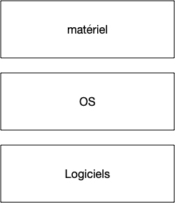

Le but d'un [ordinateur](https://fr.wikipedia.org/wiki/Ordinateur) est d'exécuter des [processus](https://fr.wikipedia.org/wiki/Processus_(informatique)). Pour que chaque processus n'ait pas à tout gérer (accès au processeur, à la mémoire, au disque dur, au réseau, ...) comme on le ferait avec un circuit imprimé par exemple, on utilise un [système d'exploitation](https://fr.wikipedia.org/wiki/Syst%C3%A8me_d%27exploitation) (ou ***OS*** pour *operating system*).

Son but est de faire le lien entre le [matériel](https://fr.wikipedia.org/wiki/Mat%C3%A9riel_informatique) (*hardware*) et le [logiciel](https://fr.wikipedia.org/wiki/Logiciel) (*software*).

Le matériel comporte tous les éléments physique d'une machine :

* processeur
* mémoire
* disques dur
* clavier, souris, écran
* carte réseau
* ...

D'un point de vue système, on sépare ces éléments en trois catégories :

* processeur
* mémoire
* les périphériques ou *devices* qui regroupent tout le reste. Ce sont les *"appareils"* qui se branchent sur la [carte mère](https://fr.wikipedia.org/wiki/Carte_m%C3%A8re).

Les logiciels, que d'un point de vue système on appellera [processus](https://fr.wikipedia.org/wiki/Processus_(informatique)) auront besoin pour fonctionner d'accéder :

* au processeur pour effectuer les différentes opérations de leur code,
* à la mémoire pour stocker leurs variables
* parfois à des devices comme un disque dur (pour lire un fichiers), à la carte réseau (pour aller lire le contenu du site [hacker news](https://news.ycombinator.com/)), en encore au clavier, etc

Le but d'un système d'exploitation est double :

* il permet d'utiliser des devices de l'ordinateur grâce à des [drivers](https://fr.wikipedia.org/wiki/Pilote_informatique)
* il permet l'exécution de process :
  * en parallèle (on peut écrire dans un gdoc tout en écoutant de la musique)
  * de façon sécurisée : le gdoc ne peut accéder aux variables de l'application jouant de la musique

Un système d’exploitation n'est pas monolithique, il est constitué de multiple partie qui forment un tout cohérent.

## Couches Systèmes

L'organisation logicielle d'un ordinateur (ou plus généralement tout système logiciel assez important) est constitué de *couches*, comme le stipule le [théorème fondamental de l’ingénierie logicielle](https://en.wikipedia.org/wiki/Fundamental_theorem_of_software_engineering) :

> On peut régler tous les problèmes en ajoutant une couche d'indirection

Un autre exemple célèbre de couches en ingénierie système est le découpage en [couches d'un réseau](https://fr.wikipedia.org/wiki/Suite_des_protocoles_Internet). Ce principe universel est une instanciation de la [deuxième partie du discours de la méthode](https://fr.wikipedia.org/wiki/Discours_de_la_m%C3%A9thode#Deuxi%C3%A8me_partie) qui stipule de diviser chaque difficulté en autant de parties facile à résoudre séparément. D'un point de vue ingénierie, ceci permet en plus de  clairement les responsabilités de chaque couche, une maintenance plus aisée.

Un ordinateur et son utilisation peut être peu ou prou être séparé quatre couches :

1. Matériel
   * mémoire RAM
   * disques durs
   * cartes réseau
   * ...
2. Noyau
   * drivers matériels
   * gestion de la mémoire
   * [ordonnancement des processus](https://fr.wikipedia.org/wiki/Ordonnancement_dans_les_syst%C3%A8mes_d%27exploitation)
3. process
   * interface graphique
   * terminal
   * ...
4. utilisateurs
   * qui à le droit de faire quoi

Les utilisateurs lancent les process. Ces process s'exécutent de façon parallèle grâce au noyau.

Seul le noyau communique avec le matériel, les processus utilisateurs parlent au noyau grace à des [appels systèmes](https://fr.wikipedia.org/wiki/Appel_syst%C3%A8me).

## Système d'exploitation

Seul le noyau a accès au matériel et a un contrôle total de la machine. Il doit donc être le plus petit possible car le moindre bug fait planter la machine. C'est pourquoi on distingue deux états d'une machine :

* le *kernel mode* : le noyau travail
* le *user mode* : un process travaille


[User et Kernel mode sous windows 11](https://learn.microsoft.com/fr-fr/windows-hardware/drivers/gettingstarted/user-mode-and-kernel-mode)


Un système d'exploitation ne peut donc être uniquement composé d'un noyau, ce serait inefficace (rien ne pourrait être exécuté en parallèle) et dangereux (le moindre bug logiciel ou matériel ferait tout planter). On peut raisonnablement considérer qu'il est constitué de 3 parties :

* **le** [noyau](https://fr.wikipedia.org/wiki/Noyau_de_syst%C3%A8me_d%27exploitation) (*kernel*)
* **des** [interfaces logicielles](https://en.wikipedia.org/wiki/Interface_(computing)#Software_interfaces) qui permettent d'accéder aux devices (comme accéder à une clé usb)
* **des** [démons](https://fr.wikipedia.org/wiki/Daemon_(informatique)) qui gèrent l'environnement (le fait de réagir à l'insertion d'une clé usb dans l'ordinateur)

Les démons et les interfaces sont des process comme les autres. Ils sont cependant exécutés par un utilisateur spécial, souvent nommé [`root`](https://fr.wikipedia.org/wiki/Utilisateur_root), qui est le [super-utilisateur] qui est le représentant utilisateur du système.

## Process

Un process est un ensemble d'instruction exécutées par le système d'exploitation. Tout process est la propriété le l'utilisateur du système qui l'a exécuté. Un process ne peut de plus a priori pas sortir de sa zone d'influence qui est :

* l'exécution d'une instruction de son code
* son espace mémoire réservé

Selon le point de vue du process, il est seul au monde. Lorsqu'il veut interagir avec le système (réserver de la mémoire, lire un fichier sur le disque dur, ...) son seul interlocuteur est le noyau qu'il appelle via des [appels systèmes](https://fr.wikipedia.org/wiki/Appel_syst%C3%A8me). Le noyau vérifie que propriétaire du process à bien le droit d'accéder à cette ressource avant d'effectuer l'opération demandée.

## Utilisateurs

On peut séparer les utilisateurs d'un système en trois grandes catégorie.

### `root`

L'utilisateur `root` est l'utilisateur lié au système d'exploitation. Il est le propriétaire des process (démons) et interfaces du système d'exploitation. Cet utilisateur a ainsi tous les droits (peut aller partout, réserver autant de mémoire qu'il veut, etc).

Comme **Tout** processus a un propriétaire, l'existence de cet utilisateur est garantie.

### Administrateurs systèmes


[administrateur système](https://fr.wikipedia.org/wiki/Administrateur_syst%C3%A8me)


Ces utilisateurs ont des droits particulier, ils peuvent modifier des paramètres systèmes et exécuter ou stopper des démons. Ces utilisateur ne sont pas forcément root, en effet,  souvent l'utilisateur principal d'une machine est administrateur.

Cela permet, si nécessaire, d'installer ou de configurer son système sans être connecté en tant que root.

### Simple utilisateur

Enfin, il existe la foule des autres utilisateurs (vous sur les ordinateurs de l'école ou la fac par exemple) qui ne peuvent pas administer la machine, ni lancer de démons. Vous avez en revancje le droit d'exécuter la plupart des process et d'installer vos propres programme dans l'espace disque qui vous est réservé.

## Démarrage de l'ordinateur

Les différentes étapes du chargement d'un système d'exploitation

1. boot de l'ordinateur
2. exécution d'un [chargeur d'amorçage (*bootloader*)](https://fr.wikipedia.org/wiki/Chargeur_d%27amor%C3%A7age)
3. charge le noyau
   1. vérification du matériel
   2. vérification des sous-systèmes : réseau, ...
4. passage en user mode puis charge les démons et les interfaces
5. login
