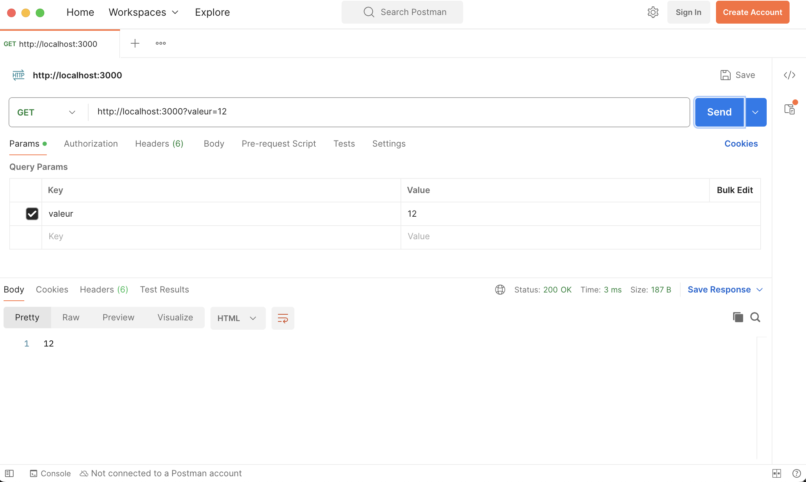

Faire une API avec son serveur.

Gérer des données côté serveur nécessite plusieurs actions bien distinctes :

1. organisation des requêtes possible sous la forme d'une API
2. manipulation d'une donnée : CRUD
3. transfert et stockage : sérialisation

## API


<https://fr.wikipedia.org/wiki/Interface_de_programmation>


L'échange de données entre le client et le serveur se fait grâce à une API qui détermine les routes utilisables (en utilisant des routes paramétrables). Il existe plusieurs moyens d'organiser une API :

- par query : Une route générale est paramétrable par query. C'est la façon de faire de google maps par exemple (voir par exemple la [documentation pour choisir un chemin](https://developers.google.com/maps/documentation/directions/get-directions))
- sous la forme d'une URL. L'accès au données se fait sous la forme d'un chemin. C'est la [façon de faire REST](https://developer.mozilla.org/fr/docs/Glossary/REST) par exemple.
- requête dans le corps du massage. Plutôt que d'utiliser des query, on place directement la requête dans le corps du message. C'est la façon de faire de la populaire bibliothèque [graphql](https://graphql.org/) par exemple.

## CRUD

Cet acronyme signifie :

- **C**reate : création de la donnée
- **R**ead : lecture de la donnée
- **U**pdate : mise à jour de la donnée
- **D**elete : suppression de la donnée

Et rappelle le cycle de vie d'une donnée. Il faut que l'API puisse permettre au client d'effectuer ces actions CRUD pour chacune des données (si possible). On a coutume d'expliciter ces requêtes en utilisant des [méthodes HTTP](https://fr.wikipedia.org/wiki/Hypertext_Transfer_Protocol#M%C3%A9thodes) différentes :

- lire une donnée se fera en utilisant la méthode `GET` (c'est ce que l'on fait habituellement)
- créer une donnée se fera en utilisant la méthode `POST` (c'est ce que l'on fait habituellement)
- mettre à jour une donnée se fera en utilisant la méthode `PUT` (c'est ce que l'on fait habituellement)
- supprimer une donnée se fera en utilisant la méthode `DELETE` (c'est ce que l'on fait habituellement)

On ne peut via un navigateur qu'utiliser des méthode get. Pour utiliser les autres méthodes, on peut utiliser [fetch](https://developer.mozilla.org/en-US/docs/Web/API/fetch) en javascript en spécifiant la méthode à utiliser


Pour tester les méthodes lorsque l'on est entrain de développer, on a coutume d'utiliser une application tierce, comme <https://www.postman.com/> par exemple (on peut l'utiliser de façon gratuite sans avoir besoin de s'inscrire)


Souvent, on n'a besoin que des méthodes GET (pour lire) et POST (pour écrire et mettre à jour) la donnée. Par exemple, supposons que l'on veuille stocker une unique donnée. On veut pouvoir :

- lire la donnée avec la route : <http://127.0.0.1:3000/> en utilisant la méthode GET (la méthode utilisée par défaut par les navigateurs)
- écrire la données avec la route <http://127.0.0.1:3000/?valeur=12> en utilisant la méthode POST

On peut utiliser le code express suivant :

```javascript
import express from 'express'

const app = express()

const hostname = '127.0.0.1';
const port = 3000;

let donnée = {
    valeur: 42
}

app.get('/', (req, res) => {
    res.statusCode = 200;
    res.setHeader('Content-Type', 'text/json; charset=utf-8');

    res.end(donnée..stringify());

})


app.post('/', (req, res) => {

    donnée = req.query.valeur;
    res.redirect('/');

})


app.listen(port, hostname);
console.log(`Server running at http://${hostname}:${port}/`);
```

Plusieurs remarques :

- vous voyez comment express permet facilement de différentier les méthodes : `app.get`{.language-} pour des méthodes `GET` et `app.post`{.language-} pour des méthodes `POST`
- à la fin de la méthode post la ligne `res.redirect('/')`{.language-} est importante. C'est le pattern [Post/Redirect/Get](https://en.wikipedia.org/wiki/Post/Redirect/Get) (aussi appelé _Redirect after post_) qu'il faut que vous utilisiez après chaque requête post. Elle permet de refaire une requête GET après la méthode post (dans notre exemple on refait une requête GET vers `/` mais cela peut différer selon ce que vous voulez faire). Ceci pour éviter — entre autre — de renvoyer une donnée lorsque l'on rafraîchit le navigateur.

Il nous est impossible de tester des requêtes POST directement avec le navigateur, nous les utiliserons via des requêtes fetch en javascript plus tard. Pour l'instant testons notre serveur avec [postman](https://www.postman.com/).



1. créez le projet serveur.
2. Utilisez <https://www.postman.com/> pour tester la route `/` en GET




Pour le projet n'oubliez pas d'ajouter le module express et de préciser à node que l'on utilise des modules ES6.

Ensuite la requête postman doit donner :


On voit bien que le retour (le body de la requête) est 42.


Une fois l'exercice précédent réussi, on peut tenter la requête POST :



1. Utilisez <https://www.postman.com/> pour tester la route `/&valeur=12` en POST
3. demandez la route `/` en GET. Est-ce cohérent ?



La requête POST modifie une valeur dans le serveur :


En refaisant une requête GET ensuite, on voit bien que la valeur a été modifiée côté serveur.




On vérifie que l'on a bien compris tout ce qu'il s'est passé :



1. Utilisez <https://www.postman.com/> pour tester la route `/&valeur=12` en GET. Que se passe-t-il ?
2. Pourquoi la requête `/&valeur=12` en POST rend-elle un résultat dans le body ?



La seule route GET de notre serveur est `/`. C'est cette route qui a été choisie :



La requête POST rend quelque chose dans le body car postman suit directement les redirect. C'est la réponse du redirect ue l'on observe. On peut le vérifier en supprimant le redirect automatique :


et en recommençant la requête :




## JSON pour sérialiser ses données

La [sérialisation/désérialisation](https://fr.wikipedia.org/wiki/S%C3%A9rialisation) est l'opération consistant à transformer une donnée en un format facilement transportable/stockable et à procéder à l'opération inverse pour retrouver la donnée originelle.

Cette opération est cruciale dans toute gestion des données. Pour le web :



- les données : des dictionnaires javascript
- le format facilement transportable : le texte (utf8).

La façon de convertir les dictionnaires en texte et réciproquement est régie par le [json](https://www.json.org/json-fr.html)



Le json est tellement bien fait qu'il est utilisé partout ! Il est en effet très facile à lire, à modifier avec un simple éditeur de texte, et à transférer avec une simple requête http.

Le code suivant est la version json du serveur précédent :

```javascript
import express from 'express'

const app = express()

const hostname = '127.0.0.1';
const port = 3000;

let donnée = {
    valeur: 42
}

app.use(express.json())

app.get('/', (req, res) => {
    res.json(donnée);

})


app.post('/', (req, res) => {
    // console.log(req.body)

    donnée.valeur = req.body.valeur;
    res.redirect('/');

})


app.listen(port, hostname);
console.log(`Server running at http://${hostname}:${port}/`);
```

On utilise un middleware express [`express.json()`](https://expressjs.com/en/5x/api.html#express.json) qui ajoute un attribut body à la requête contenant ce que auà envoyé le client.


Vous verrez des tutoriels qui vous font installer `body-parser`, ils sont obsolètes. Depuis express 4.16, on peut utiliser express directement.


Lorsque l'on veut envoyer directement on place directement le json dans le corps du message (body) que l'on envoie :


Attention dans postman à bien choisir `raw` comme format d'envoie et à choisir `json`  comme format raw.
