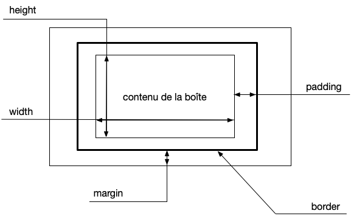
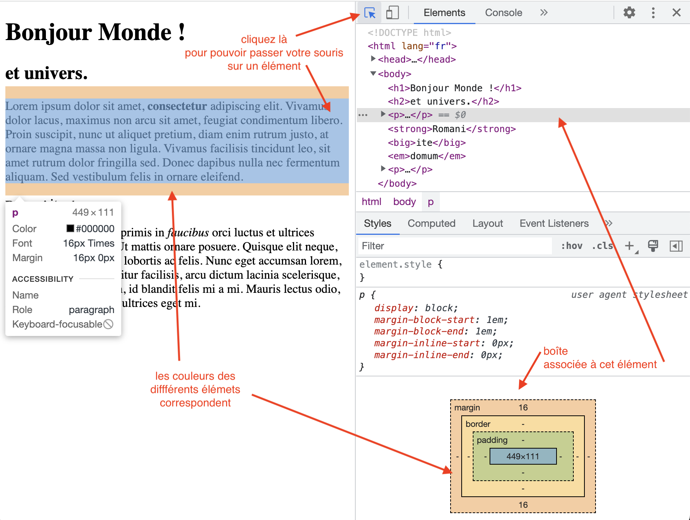

<!-- début résumé -->

Modèle de Boites positionnement et propriétés css.

<!-- fin résumé -->


<https://developer.mozilla.org/fr/docs/Learn/CSS/Building_blocks/The_box_model>


Chaque balise html est une boite qu'il faut représenter à l'écran. Cette représentation est de cette forme :



Le contenu de la boîte pouvant — bien sûr — être d'autres boites (les enfants de la balise).

La représentation graphique de la boite est contrôlé par de nombreuses propriétés css, que nous allons passer en revue.

Nous utiliserons ce code html pour nos expérimentations :

<span id="exemple"></span>

```html
<!doctype html>
<html lang="fr">
  <head>
    <meta charset="utf-8"/>
    <title>Modèle de boîte</title>
    <style>
    </style>
  </head>
  <body>
    <h1>Bonjour Monde !</h1>
    <h2>et univers.</h2>
    <p>
      Lorem ipsum dolor sit amet, <strong>consectetur</strong> 
      adipiscing elit. Vivamus dolor lacus, maximus non arcu sit amet,
      feugiat condimentum libero. Proin suscipit, nunc ut aliquet
       pretium, diam enim rutrum justo, at ornare magna massa non 
       ligula. Vivamus facilisis tincidunt leo, sit amet rutrum dolor 
       fringilla sed. Donec dapibus nulla nec fermentum aliquam. Sed 
       vestibulum felis in ornare eleifend.
    </p>
    <p>
      Vestibulum ante ipsum primis in <em>faucibus</em> orci luctus et
      ultrices posuere cubilia curae; Ut mattis ornare posuere. Quisque elit
      neque, lacinia ac vestibulum a, lobortis ac felis. Nunc eget accumsan
      lorem, id interdum sem. Curabitur facilisis, arcu dictum lacinia
      scelerisque, ante augue varius lorem, id blandit felis mi a mi. Mauris
      lectus odio, rutrum sed gravida vel, ultrices eget mi.
    </p>
  </body>
</html>
```


Créer un fichier `boites.html`{.fichier} qui contient le code html précédent et ouvrez le avec chrome.


Les outils de développement vous permettent de visualiser la boîte associée à chaque élément :



## Affichage : balise `display`{.language-}



* <https://developer.mozilla.org/fr/docs/Web/CSS/display>
* <https://www.w3schools.com/html/html_blocks.asp>
* <https://developer.mozilla.org/fr/docs/Web/CSS/CSS_Flow_Layout/Block_and_Inline_Layout_in_Normal_Flow>



La propriété `display`{.language-} est la plus importante, puisqu'elle détermine si et comment vont être représentés les balises.


Remplacez le style du fichier `boites.html`{.fichier} par :

```html
    <style>
      strong {
        display: none;
      }
    </style>
```

rechargez le fichier et voyez comment les éléments `<strong></strong>`{.language-} ont disparu.




Notez que si le display est placé à `none`{.language-}, l'élément est tout simplement ignoré. Ce n'est pas identique à : `visibility: hidden;`{.language-} qui ne fait que cacher l'élément (sa place est réservée). Testez la différence !


Il existe [de nombreuses valeurs possibles](https://www.w3schools.com/cssref/pr_class_display.asp) à la propriété display. Nous allons en présenter trois ici.

### `display: block`{.language-}

Comme les éléments `<p></p>`{.language-} ou encore `<h1></h1>`{.language-}.


Les éléments de display ***block*** commencent **en-dessous** de la boîte précédente et prennent, **par défaut** la largeur de la fenêtre.

Leur hauteur est **par défaut** la hauteur nécessaire pour représenter son contenu.

Les éléments de display block, se suivent **les uns en dessous des autres**.



Utilisez les outils de développement pour voir comment les éléments `<p></p>`{.language-} s'agencent les uns en dessous des autres.


Changez le display des éléments `<strong></strong>`{.language-} à `block`{.language-} et observez le résultat.


### `display: inline`{.language-}


Les éléments de display ***inline*** commencent **à la suite** de l'élément inline précédent et n'ont **pas de largeur (`width`{.language-}) ni de hauteur `height`{.language-})**.

Les éléments de display inline, se suivent **les uns à côté des autres**.



Changez le display des éléments `<h1></h1>`{.language-} et `<h2></h2>`{.language-} à `inline`{.language-} et observez le résultat.


Pourquoi ne se passe-t-il rien si on ne change qu'un des deux éléments à `inline`{.language-}


Car un élément de display `block`{.language-} commence toujours au bord et prend toute la place. Il ne peux donc rien y avoir avant ni après.


### `display: inline-block`{.language-}


Les éléments de display ***inline-block*** commencent **à la suite** de l'élément inline ou inline-block précédent.

Les éléments de display inline, se suivent **les uns à côté des autres**.


Les éléments de display `inline-block`{.language-} ont une taille, un padding et une marge.


Voyez les différences de représentation en supprimant ou pas la propriété `display: inline-block;`{.language-} du style suivant :

```html
    <style>
      strong {
        padding: 100px;
        margin: 100px;
        border: 1px solid;
        display: inline-block;
      }
    </style>
```



## width et height



* <https://developer.mozilla.org/fr/docs/Web/CSS/width>
* <https://developer.mozilla.org/fr/docs/Web/CSS/height>



Les propriétés `min-width`{.language-}, `max-width`{.language-}, `min-height`{.language-} et `max-height`{.language-} permettent de garder de la flexibilité dans la taille des boîtes tout en contrôlant le design.

Attention aux effets de bord, si l'on donne une hauteur trop petite pour contenir l'élément, il va *déborder*. On peut utiliser la propriété [`overflow`{.language-}](https://developer.mozilla.org/fr/docs/Web/CSS/overflow) pour le gérer.


Choisissez une hauteur trop petite pour contenir les paragraphes et regardez les déborder.

Utilisez ensuite la propriété `overflow: hidden;` pour cachez le surplus.


## border



<http://css.mammouthland.net/border-css.php>



Il existe plein de propriétés css qui gèrent le bord. Elles commencent toutes par `border-`{.language-}. Elles peuvent être (presque) toutes agrégées dans la propriété [border](https://developer.mozilla.org/fr/docs/Web/CSS/border)


On peut faire des choses assez jolies en utilisant [`border-radius`{.language-}](https://www.tutorialkart.com/css/css-border-radius/)


## margin



<https://developer.mozilla.org/fr/docs/Web/CSS/margin>



Si deux éléments de display `block`{.language-} se suivent, la marge entre les deux block sera du maximum des deux marge et non la somme. C'est ce que l'on appelle : [fusion des marges](https://developer.mozilla.org/fr/docs/Web/CSS/CSS_Box_Model/Mastering_margin_collapsing).

Les marges hautes et basses des éléments de display `inline`{.language-} ne sont pas prises en compte.

Un cas classique d'utilisation des marges est pour les images. L'élément `</img>`{.language-} sont normalement de display `inline`{.language-}. Si l'on veut centrer une image, la solution habituelle est de placer comme style :

```html
    <style>
      img {
        display: block;
        margin: auto;
      }
    </style>
```


Essayez de centrer une image.

Vous pourrez par exemple utiliser cette image : ``{.language-}



## padding



<https://developer.mozilla.org/fr/docs/Web/CSS/padding>



Les paddings haut et bas des éléments de display `inline`{.language-} ne sont pas prises en compte. Mais ce padding existe. On le voit par exemple lorsque l'on ajoute un bord.


Mettez le style ci-après et voyez comment le bord est influencé par le padding, bien que ce dernier ne soit pas pris en compte dans la représentation de la boite.

```html
    <style>
      strong {
        padding: 100px;
        border: 1px solid;
      }
    </style>
```


