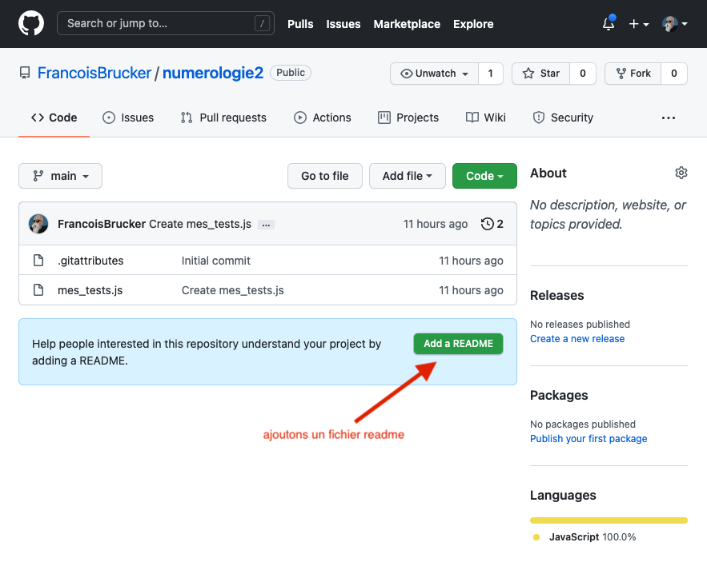

<!-- début résumé -->

Code js.

<!-- fin résumé -->

Nous allons après chaque tâche faire un commit et, à la fin de chaque étape envoyer les modifications sur le serveur.


Un commit doit être de taille raisonnable et, si possible, ne concerner qu'une seule tâche.


Le message de commit (obligatoire) est très important lorsque l'on fera l'historique du projet. De pus, il faut savoir qui a fait quoi et pouvoir le contacter au besoin : votre nom et mail *doivent* être correct


Le nom utilisé dans un commit reste toute la durée de vie du projet (et ça peut être très long). Donc gardez votre nom réel, il est peu probable que vous ayez à en changer.


## Application github

Si vous n'avez pas modifié votre projet, vous devriez avoir une fenêtre qui ressemble à ça :


* Menu du haut, organisé en menu :
  * *current repository* : votre dossier sur **votre** ordinateur
  * *Current branch* : la [branche](https://www.atlassian.com/fr/git/tutorials/using-branches) `main` (anciennement appelée `master`)
  * *Fetch origin* : regarde l'état du projet sur github.
* Barre verticale, organisée en onglet :
  * onglet *changes* : [rien n'a changé](https://www.youtube.com/watch?v=V9Po8lSIKww)
  * onglet *History* : voir l'historique de votre projet. Si on clique dessus on voit :
    * les différents commit et leur message
    * qui a commit
    * ce qui a été commit (le format est un [format spécial](https://www.oreilly.com/library/view/git-pocket-guide/9781449327507/ch11.html). Il a l'air compliqué come ça mais en fait c'est très simple : les `+` ont été ajouté, les `-` ont été supprimés.


## Tâche 1

Il n'y a pas de fichier écrit, donc aucune raison de faire de commit.

## Tâche 2

On implémente la [tâche 2 du niveau 1](../../niveau-1/2-code_js#tache-2)

A la fin de cette tache, on voit qu'il y a 1 changement : un nouveau fichier. On vérifie le message de commit (*Create numerologie.js*) et on "commit to main".

On voit qu'il y a une flèche dans la barre du haut dans le menu *Push Origin*. Cela veut dire que notre code est plus loin d1 commit de ce qu'il y a sur le serveur. Cela se voit aussi dans l'historique :


Nous n'allons pas pousser tout de suite nos changement sur le serveur. On va attendre d'avoir fait des changements significatifs dans le code.


Ne poussez pas chaque commit sur le serveur. Attendez d'avoir fait des changements significatifs. Mais commitez tout de même au moins 1 fois par jour sur le serveur (règle au doigt mouillé), pour montrer vos progrès au reste de l'équipe.



## Tâches 3 et 4

On implémente les [tâche 3 du niveau 1](../../niveau-1/2-code_js#tache-3) et [tâche 4 du niveau 1](../../niveau-1/2-code_js#tache-4).

Notre fenêtre du projet git montre 1 changement : la modification du fichier *"numérologie"*. Le format patch nous montre ce qui a changé. Avant de faire le commit, on va changer le message pour quelque chose de plus pertinent par rapport au projet. Pourquoi pas : "rend un chiffre à partir d'une chaîne de caractères".

>Ne vous trompez pas, c'est dans le message (cela remplace *update numerologie.js* qui est trop générique), on laisse la description vide
{.attention}


On peut maintenant commit en appuyant sur le bouton "commit to main". On est 2 commit plus loin que l'origin.

## Ajout d'un fichier depuis le site de github

Allons sur le site du projet github. Dans l'application github : *menu Repository > view on Github* et il ouvre une page web sur votre projet.

La page de mon projet ressemble à ça :



On nous demande d'ajouter un fichier `README.md`. Faisons le depuis le site de github :

```
# Numerologie

Le site qui va vous faire voir l'avenir en base 10.
```

Puis, en bas de la page, on a notre bouton commit (vert). On vérifie le message de commit ("Create README.md", c'est ok), et on clique pour commiter dans la branche `main`.

De retour sur mon ordinateur, j'essaie de pousser mes 2 commits d'avance sur le serveur et on ne me laisse pas faire :


**Cliquez** sur *fetch* pour récupérer les informations du serveur.

## Synchronisation des dossiers

On a maintenant quelque chose qui se passe souvent lorsque l'on code à plusieurs :

* j'ai avancé de mon côté (j'ai 2 commit qui n'ont pas encore été mis sur le serveur)
* le serveur a avancé de son côté et à 1 commit de plus que le serveur que je connais.

On le voit dans la fenêtre de l'application :


Ca donne quelque chose comme ça au niveaux des commit :

```text
  D : le commit du serveur
 /
A - B - C : mes commits
```

Il faut remettre tout ça à l'endroit. L'usage veut que l'on continue **toujours** depuis ce qu'il y sur le serveur. Il faut donc que l'on arrive à quelque chose du style :

```text
A - D - B' - C' : mes commits
```

Avant de repousser le tout sur le serveur.

Mes commits sont `B'` et `C'` puisque je dois les écrire depuis un code qui fait `D` alors que `B` et `C` ont été écrit depuis un code qui était À`.

C'est exactement ce qu'il va se passer si vous avez fait les configurations nécessaires. On va cliquer 2 fois sur le bouton origin. Son intitulé va changer :

1. *pull origin* : va récupérer l'état du serveur et changer nos commit en `B'` et `C'`
2. *push origin* : on va pousser sur le serveur nos 2 commits.

Notre serveur et notre ordinateurs sont synchronisés !

L'opération de rebrancher tout sur le serveur ne se passe pas toujours aussi bien. Il faudra alors [résoudre à la main les conflits](https://docs.github.com/en/get-started/using-git/resolving-merge-conflicts-after-a-git-rebase).
