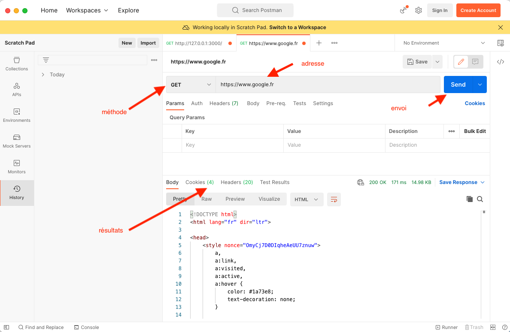

<!-- début résumé -->

Vérification des routes avec postman.

<!-- fin résumé -->

[Postman](https://www.postman.com/) est une application permettant de tester ses routes http, en particulier les routes POST que l'on ne peut pas tester directement avec un navigateur.

## Installation


[postman](https://www.postman.com/downloads/)



Il n'est pas nécessaire de s'inscrire pour télécharger la version gratuite de postman.


## Utilisation

L'utilisation est aisée pour les choses simples.

### Routes GET

#### Simple

* plusieurs onglets de requêtes
* résultats (cookes, headers http, body)

### Sans redirect

Notez que notre route a suivi la redirection.

Pour supprimer cette feature, allez dans les préférences (l'engrenage en haut à droite) et mettez sur OFF "Automatically follow redirects"

Remettez l'option à ON car c'est ce que l'on veut habituellement.

### Paramètres

<http://127.0.0.1:3000/prénom/?valeur="François">

Voyez que :

* on peut ajouter des paramètres dans l'entrée et l'url se met à jour automatiquement
* la réponse est directement formatée en json

### Routes POST

> TBD
