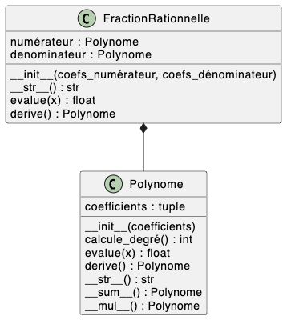

## Erreurs fréquemment rencontrées

### Question 1

Attention à bien indiquer :

- les attributs et leur type
- le constructeur
- les arguments du constructeur et des méthodes
- les types de sortie des méthodes (souvent oubliés)
- il est maladroit d'appeler l'argument du constructeur de vaut mieux l'appeler `coefficients`{.language-} par exemple, ou `tuple_coefficients`{.language-}.

### Question 4

Ne pas oublier de tester le constructeur. Pour tester le type de l'instance `p`{.language-} il est pratique d'appeler `assert isinstance(p, Polynome)`{.language-} (certains ne l'ont pas vu en TP, à voir donc).

### Question 5

Idéalement, il vaut mieux donner en arguments du constructeurs les coefficients du numérateur et du dénominateur, et construire les polynômes associés dans le constructeur, car c'est une composition.

### Question 6

Il vaut mieux partir d'un petit brouillon mathématique.

La dérivée d'un polynôme $P =\sum_{i=0}^{d}a_iX^i$ est $Q =\sum_{i=0}^{d-1}b_{i}X^i$ avec $b_i = (i+1)\cdot a_{i+1}$.

La somme de deux polynômes s'obtient en faisant la somme des coefficients de même degré. Il faut gérer le cas où les deux polynômes sont de degrés différents.

Le produit de deux polynômes $P =\sum_{i=0}^{n}a_iX^i$ et $Q =\sum_{j=0}^{m}b_{j}X^i$ est un peu plus compliqué.  Le degré du résultat est la somme $m + n$ des degrés de $P$ et $Q$.

En notant $R =\sum_{k=0}^{n+m}c_kX^i$,  le résultat du produit $P\cdot Q$, le $k$-ième coefficient est $c_k = \sum_{i=d}^{f}$ avec :

- $d = \max(0, k-m)$
- $f = \min(k, n)$

Il faut sommer tous les produits $a_ib_j$ tels que $i+j = k$, donc $j=k-i$. Les indices valides sont tels que $0 \leq i \leq n$ et $0 \leq k− i \leq m$. Ce dernier encadrement se réécrit $k− m \leq i \leq k$. Donc, en réunissant les deux encadrement, on a $\max(0, k− m) \leq i \leq \min(k, n)$, d'où les bornes dans la somme qui définit $c_k$. Cette
méthode était vraiment difficile à faire dans le temps imparti.

## Corrigé

### Question 1



La classe `FractionRationnelle`{.language-} est une composition car se compose de deux instances de `Polynome`{.language-}.

### Question 2

Les coefficients d'un polynôme sont fixés une fois pour toutes: il n'y a pas de changement possible dans leur valeur ni dans leur nombre (le degré du polynôme). Il n'y a donc aucune raison de prendre une liste plutôt qu'un tuple, et il vaut mieux faire au plus simple. On peut aussi voir un polynôme comme une composition de
coefficients, ce qui justifie le choix du tuple.

### Question 3-6

Fichier `polynome,py`{.fichier} :

```python
class Polynome:
    def __init__(self, coefs):
        self.coefs = tuple(coefs)

    def calcule_degré(self):
        return len(self.coefs) - 1

    def évalue(self, x):
        px = 0
        for i in range(len(self.coefs)):
            px += self.coefs[i] * x ** i
        return px

    def derive(self):
        coefs = []
        for i in range(0, self.calcule_degré()):
            coefs.append(self.coef[i+1] * (i+1))
        return Polynome(coefs)
    
    def __call__(self, x):
        return self.évalue(x)

    def __add__(self, other):
        deg_self = self.calcule_degré()
        deg_other = other.calcule_degré()
        if deg_self < deg_other:
            return other + self
        somme_coefs = list(self.coefs)
        for i in range(len(other.coefs)):
            somme_coefs[i] += other.coefs[i]
        return Polynome(somme_coefs)

    def __mul__(self, other):
        deg1 = self.calcule_degré()
        deg2 = other.calcule_degré()
        degré = deg1 + deg2
        coefs = []
        for k in range(degré+1):
            c = 0
            ind_start = max(0, k-deg2)
            ind_end = min(deg1, k)
            for i in range(ind_start, ind_end+1):
                c += self.coefs[i] * other.coefs[k-i]
            coefs.append(c)
        return Polynome(coefs=coefs)

    def __str__(self):
        s = ''
        for i in range(len(self.coefs)):
            print(i)
            s += f'+ {str(self.coefs[i])} X ** {i} '
        return s[:-1]

    def str2(self):
        s = ''
        for i in range(len(self.coefs)-1, -1, -1):
            if self.coefs[i] == 0:
                continue
            if i < self.calcule_degré() - 1:
                if self.coefs[i] >= 0:
                    s += ' + '
                else:
                    s += ' '
            s += str(self.coefs[i])
            if i == 1:
                s += ' X'
            elif i > 1:
                s += f' X ** {i}'
        return s


class FractionRationnelle:
    def __init__(self, coefs_numérateur, coefs_dénominateur):
        self.numérateur = Polynome(coefs_numérateur)
        self.dénominateur = Polynome(coefs_dénominateur)
    
    def évalue(self, x):
        return self.numérateur.évalue(x) / self.dénominateur.évalue(x)
    
    def __call__(self, x):
        return self.numérateur(x) / self.dénominateur(x)
    
    def dérive(self):
        u = self.numérateur
        v = self.dénominateur
        return FractionRationnelle(u.derive() * v - u * v.derive(), u * u)

```

Fichier `test_polynome,py`{.fichier} :

```python
from polynome import Polynome


def test_constructeur():
    p = Polynome(coefs=(1, -0.5, 0, 3))
    assert isinstance(p, Polynome)
    assert isinstance(p.coefs, tuple)
    assert len(p.coefs) == 4
    assert p.coefs == (1, -0.5, 0, 3)

    # Avec une liste
    p = Polynome(coefs=[1, -0.5, 0, 3])
    assert isinstance(p, Polynome)
    assert isinstance(p.coefs, tuple)
    assert len(p.coefs) == 4
    assert p.coefs == (1, -0.5, 0, 3)


def test_calcule_degré():
    p = Polynome(coefs=(1, -0.5, 0, 3))
    assert p.calcule_degré() == 3

    p = Polynome(coefs=(-1,))
    assert p.calcule_degré() == 0


def test_évalue():
    p = Polynome(coefs=(1, -0.5, 0, 3))
    assert p.évalue(0) == 1
    assert p.évalue(1) == 3.5
    assert p.évalue(2) == 24
    assert p.évalue(-1) == -1.5


def test_call():
    p = Polynome(coefs=(1, -0.5, 0, 3))
    assert p(0) == 1
    assert p(1) == 3.5
    assert p(2) == 24
    assert p(-1) == -1.5


def test_str():
    p = Polynome(coefs=(1, -0.5, 0, 3))
    assert str(p) == "+ 1 X ** 0 + -0.5 X ** 1 + 0 X ** 2 + 3 X ** 3"


def test_str2():
    p = Polynome(coefs=(1, -0.5, 0, 3))
    assert p.str2() == "3 X ** 3 -0.5 X + 1"


def test_sum():
    p1 = Polynome(coefs=(2, -0.5, 1, 1))
    p2 = Polynome(coefs=(-1, 0, -1, 2))
    p = p1 + p2
    assert p.coefs == (1, -0.5, 0, 3)

    p1 = Polynome(coefs=(1, 0, 0, 3))
    p2 = Polynome(coefs=(0, -0.5))
    p = p1 + p2
    assert p.coefs == (1, -0.5, 0, 3)


def test_mul():
    p1 = Polynome((-1,))
    p2 = Polynome((2,))
    p12 = p1 * p2
    assert p12.coefs == (-2,)

    p1 = Polynome((0, 1))
    p2 = Polynome((0, 1))
    p12 = p1 * p2
    assert p12.coefs == (0, 0, 1)

    p1 = Polynome((-1, 0, -3))
    p2 = Polynome((-4, 5))
    p12 = p1 * p2
    assert p12.coefs == (4, -5, 12, -15)

```
