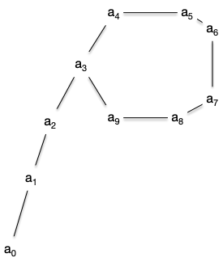

Le but du projet est de résoudre le problème algorithmique suivant :



- Nom : Doppelganger
- Entrée : Un tableau de $n$ entiers compris entre 1 et $n-1$
- Sortie : Un entier $v$ tel qu'il existe $0\leq i\neq j < n$ avec $v = T[i] = T[j]$



## Rendu

Le projet comporte deux partie : l'une algorithmique et l'autre dédiée au code.

Il faudra rendre la partie algorithmique sous la forme d'un fichier markdown et la partie développement sous la forme d'un projet informatique.

### Ordre des questions

Le but du projet est de faire les questions dans l'ordre. Non seulement les questions se suivent, mais elles racontent une histoire. La suivre vous permettra, j'espère, de passer un bon moment algorithmique.

### Partie algorithmique

Tout algorithme doit être donné en pseudocode et être démontré (finitude et correction).

### Partie code

Toute fonction devra être testée.

## I. Prélude

Commençons par montrer que notre problème est bien défini et algorithmique.

### I.1 Existence

#### I.1.1

Démontrez que l'entier $v$ du problème _Doppelganger_ existe toujours.

#### I.1.2

Démontrez que le problème _Doppelganger_ peut admettre plusieurs solutions.

### I.2 Algorithme

Montrez que l'algorithme suivant permet de résoudre le problème _Doppelganger_ avec comme complexités :

- temporelle en $\mathcal{O}(n^2)$
- spatiale en $\mathcal{O}(1)$ (sans compter l'entrée)

```pseudocode
algorithme doppelganger_naif(T: [entier]) → entier:
    pour chaque i de [0, T.longueur -1 ]:
        pour chaque j de [i+1, T.longueur -1]:
            si T[i] == T[j]:
                rendre T[i]
```

### I.3 Complexité du problème

Le but du problème est de trouver une solution optimale au problème. Commençons par donner des bornes à celui-ci.

#### I.3.1

Montrer que la complexité temporelle du problème _Doppelganger_ est en $\Omega(n)$ et en $\mathcal{O}(n^2)$.

#### I.3.2

Montrer que la complexité spatiale du problème _Doppelganger_ est en $\mathcal{O}(1)$ (sans compter l'entrée).

### I.4 Simulation

On vous demande de  créer un projet vscode dans le dossier `doppelganger`{.fichier}. Ce projet contiendra :

- un fichier `doppelganger.py`{.fichier}
- un fichier `test_doppelganger.py`{.fichier} qui contiendra les tests des fonctions du fichier `doppelganger.py`{.fichier}
- autant de programmes principaux que demandé dans la suite du projet.

#### I.4.1 Vérification

Créez une fonction python vérifiera qu'un tableau passé en paramètre est une entrée valide du problème doppelganger Qui devra rendre une entrée du problème. Sa signature doit être :

```python
doppelganger_valide(T: [int]) → bool
```

#### I.4.2 Entrée

Créez une fonction python Qui devra rendre une entrée du problème. Sa signature doit être :

```python
doppelganger_entrée(n: int) → [int]
```

Vous ferez en sorte que la probabilité que T[i] soit égal à x soit de 1/(n-1) quelque soient x et i.

#### I.4.3 Sortie

Implémentez l'algorithme du I.2 dans une fonction de signature :

```python
doppelganger_naif(T: [int]) → int
```

#### I.4.4 programme principal

Créez un programme principal dans un fichier `main_I.py`{.fichier} permettant à un utilisateur de rentrer une taille de tableau. Le programme devra :

1. rendre une sortie du problème Doppelganger
2. donner le temps mis par l'algorithme pour s'exécuter

## II. Une première borne

Affinons un peu la complexité de notre problème.

### II.1 Trié

#### II.1.1

Montrer que si le tableau en entrée du problème est trié, on peut résoudre le problème Doppelganger en temps linéaire.

#### II.1.2

Déduire de la question précédente un algorithme modifiant le tableau en entrée et résolvant le problème Doppelganger avec une complexité :

- temporelle en $\mathcal{O}(n\log(n))$
- spatiale en $\mathcal{O}(1)$ (sans compter l'entrée)

#### II.1.3

Implémentez l'algorithme du II.1.2 dans une fonction de signature :

```python
doppelganger_tri(T: [int]) → int
```

#### II.1.4

Créez un programme principal dans un fichier `main_II.py`{.fichier} permettant à un utilisateur de rentrer une taille de tableau. Le programme devra :

1. rendre une sortie du problème Doppelganger
2. comparer les temps d'exécution des deux algorithmes `doppelganger_tri`{.language-} et `doppelganger_naif`{.language-}

#### II.1.5

Expérimentalement, votre algorithme naif doit très souvent aller plus vite que votre algorithme qui tri au préalable votre tableau. Si cela n'arrive pas, faite une amélioration de votre algorithme naif pour que cela arrive.

Pourquoi ?


Vous pourrez utiliser le fait que $\lim_{n\to +\infty}(1-1/n)^n = 1/e$.


#### II.1.6

Donnez un tableau d'entré où le programme de tri est plus rapide que l'algorithme naïf et vérifiez le expérimentalement en ajoutant ce tableau à `main_II.py`{.fichier}.

### II.2

Utilisons le fait que les entiers dont sont composés le tableau pour lequel il faut trouver le doublon sont entre 0 et n-1, soit les indices d'un tableau de taille $n$.

#### II.2.1

Montrez qu'en utilisant un tableau `B`{.language-} de taille $n$ de booléens, on peut créer un algorithme permettant de résoudre le problème Doppelganger avec une complexité :

- temporelle en $\mathcal{O}(n)$
- spatiale en $\mathcal{O}(n)$ (sans compter l'entrée)

#### II.2.2

Implémentez l'algorithme du II.2.1 dans une fonction de signature :

```python
doppelganger_bool(T: [int]) → int
```

Ajoutez au programme principal du fichier `main_II.py`{.fichier} le temps d'exécution de l'algorithme `doppelganger_bool`{.language-}.

#### II.2.3

L'algorithme `doppelganger_bool`{.language-} est-il effectivement le plus rapide ?

### II.3

Utilisez la question II.2.3 pour montrer que la complexité temporelle du problème _Doppelganger_ est en $\Theta(n)$ et la complexité spatiale de $\mathcal{O}(1)$ (sans compter l'entrée).

Quelle est (pour l'instant) la complexité spatiale de l'algorithme en $\mathcal{O}(n)$ et la complexité temporelle de l'algorithme de complexité spatiale $\mathcal{O}(1)$ ?


On va montrer dans la suite qu'il existe un algorithme optimal pour les deux types de complexités en même temps !

Réfléchissez-y un instant avant de continuer. Pensez-vous que ce soit possible ?


## III. Interlude

Prenons un petit moment pour analyser un autre problème.



- Nom : Point fixe
- Entrées :
  - $f: [\\![ 1, n]\\!] \to [\\![ 1, n]\\!]$
  - $x \in [\\![ 1, n]\\!]$
- Sortie : Un entier positif $x'$ tel qu'il existe $u \neq v$ pour lesquels $f^u(x) = f^{v}(x) = x'$



### III.1 Existence

Une suite $(a_i)_{0\leq i}$ est dite _ultimement périodique_ si il existe $\lambda$ et $\mu$ tels que :

- les valeurs $a_0$ à $a_{\lambda + \mu - 1}$ sont distinctes
- $a_{ n + \lambda} = a_{ n }$ pour tout $n\geq \mu$

Une suite  ultimement périodique ressemble à un $\rho$ (rho) :



#### III.1.1

Donnez les $\lambda$ et $\mu$ pour la suite représentée par la figure précédente.

#### III.1.2

Montrez que si $(a_i)_{i\geq 0}$ est ultimement périodique alors les entiers $\lambda$ et $\mu$ sont uniques.

#### III.1.3

Montrez que si $f: [\\![ 1, n]\\!] \to [\\![ 1, n]\\!]$ et $x \in [\\![ 1, n]\\!]$ alors la suite $(a_i)_{0\leq i}$ définie telle que :

- $a_0 = x$
- $a_i = f(a_{i-1})$ pour $i>0$

est ultimement périodique.

#### III.1.4

Donnez une fonction $f: [\\![ 1, n]\\!] \to [\\![ 1, n]\\!]$ telle que la suite ultimement périodique associée (comme en III.1.3) avec $a_0 = 1$ a le même $\rho$ que la figure.

### III.2

Soit $(a_i)_{i\geq 0}$ une suite ultimement périodique de paramètres $\lambda$ et $\mu$.

#### III.2.1

Montrez qu'il existe $\mu \leq m \leq \lambda +\mu$ tel que $a_{m} = a_{2m}$.

#### III.2.2

Montrez que programme suivant est un algorithme qui rend le $a_m$ de la question précédente.

```pseudocode
programme lièvre_tortue(f: (entier) → entier,
                        x: entier
                       ) → entier:
    tortue ← f(x)
    lièvre ← f(f(x))

    tant que tortue ≠ lièvre:
        tortue ← f(tortue)
        lièvre ← f(f(lièvre))
    
    rendre tortue
```


Vous aurez remarqué qu'un des paramètres du programme est une fonction. [Le type d'une fonction est sa signature](/cours/algorithmie/pseudo-code/fonctions/#type).


#### III.2.3

Montrez que la complexité de l'algorithme `lièvre_tortue`{.language-} est en $\mathcal{O}(n)$ si $f: [\\![ 1, n]\\!] \to [\\![ 1, n]\\!]$ ?

### III.3

Nous allons chercher ici $a_\mu$ qui est le début du cycle. Soit $m$ avec $\mu \leq m \leq \lambda +\mu$ tel que $a_{m} = a_{2m}$.

#### III.3.1

Montrez que $m$ est un multiple de $\lambda$.

#### III.3.2

Utilisez la question précédente et la nature de $m$ pour montrer que $\mu = b + k \cdot \lambda$ avec $b = \mu + \lambda - m$.

#### III.3.3

Déduire de ce qui précède un algorithme de complexité temporelle $\mathcal{O}(\lambda + \mu)$ et de complexité spatiale $\mathcal{O}(1)$ pour calculer $a_\mu$.


Où se rencontrent deux tortues démarrant en $a_m$ et en $a_0$ respectivement ?


### III.4

Nous allons coder cette partie. Pour cela, créez deux fichiers, `point_fixe.py`{.language-} et `test_point_fixe.py`{.language-}, dans lesquels vous créerez les fonctions demandées.

#### III.4.1

Codez l'algorithme de la question III.2.2. Cet algorithme devra être de signature :

```pseudocode
lièvre_tortue(T: [entier]) -> entier
```

Le tableau en entrée `T`{.language-} sera un tableau de taille $n+1$ et composé d'entiers entre 1 et $n$ avec :

- $f(i) = T[i]$ pour tout $1\leq i \leq n$
- $x = T[0]$

#### III.4.2

Codez l'algorithme de la question IV.3.3. Cet algorithme devra être de signature :

```pseudocode
mu(T: [entier]) -> entier
```

Le tableau en entrée `T`{.language-} sera un tableau de taille $n+1$ et composé d'entiers entre 1 et $n$ avec :

- $f(i) = T[i]$ pour tout $1\leq i \leq n$
- $x = T[0]$

#### III.4.3

Dans un nouveau programme principal `main_III.py`{.fichier}, demandez à un utilisateur de rentrer une taille $n$ de tableau. Le programme devra :

1. afficher un tableau créé aléatoirement avec `doppelganger_entrée(n + 1)`{.language-}
2. afficher la sortie de l'algorithme `lièvre_tortue`{.language-}
3. affiche la période de la suite ultimement périodique associée au tableau commençant avec $a_\mu$

## IV. Solution optimale

Nous allons montrer dans cette partie que l'on peut résoudre le problème _Doppelganger_ avec un algorithme de complexité :

- temporelle en $\mathcal{O}(n)$
- spatiale en $\mathcal{O}(1)$ (sans compter l'entrée)

Cet algorithme sera alors optimal et en temps et en espace !

### IV.1

Soit ${(a_i)}_{i\geq 0}$ une suite ultimement périodique de paramètres $\mu > 0$ et $\lambda$.

Montrez que $f(a_{\mu - 1}) = f(a_{\mu + \lambda - 1})$ et en déduire que $a_\mu$ est une solution au problème _Doppelganger_ pour le tableau $T$ tel que :

- $T[0] = a_0$
- $f(i) = T[i]$ pour tout $1\leq i \leq n$
- $a_{i+1} = f(a_i)$

### IV.2

Déduire de ce qui précède un algorithme permettant de résoudre le problème _Doppelganger_ avec un algorithme de complexité :

- temporelle en $\mathcal{O}(n)$
- spatiale en $\mathcal{O}(1)$ (sans compter l'entrée)

### IV.3

On termine ce projet en implémentant tout ça !

#### IV.3.1

Ajoutez dans le fichier `doppelganger.py`{.fichier} un algorithme de signature :

```pseudocode
doppelganger_optimal(T: [entier]) -> entier
```

Qui résout de façon optimale en temps et en espace le problème _Doppelganger_.

#### IV.3.2

Créez un programme principal dans un fichier `main_IV.py`{.fichier} qui compare le temps mis pour résoudre le problème Doppelganger avec la version naive, triée et optimale pour une taille de tableau donnée par l'utilisateur et en utilisant 2 tableaux :

- un crée par `doppelganger_entrée`{.language-}
- l'autre dans le cas le pire pour l'algorithme naif **et** pour le tri

Vous devez expérimentalement retrouver l'ordre de complexité attendu pour le cas le pire.


Assurez vous d'être **effectivement** dans le cas le pire pour le tri ! Le tri de python est en effet en $\mathcal{O}(n)$ si le tableau initial est déjà presque trié et en $\mathcal{O}(n\log(n))$ sinon.

Pour éviter les effets de bords (non utilisation du tri et du coup algorithme avec le tri plus rapide que l'algorithme optimal), utilisez un exemple du II.1.6 pour le quel le tableau n'est pas déjà trié (vous pourrez utiliser la méthode [random.shuffle](https://docs.python.org/fr/3.13/library/random.html#random.shuffle) pour mélanger un tableau trié).


