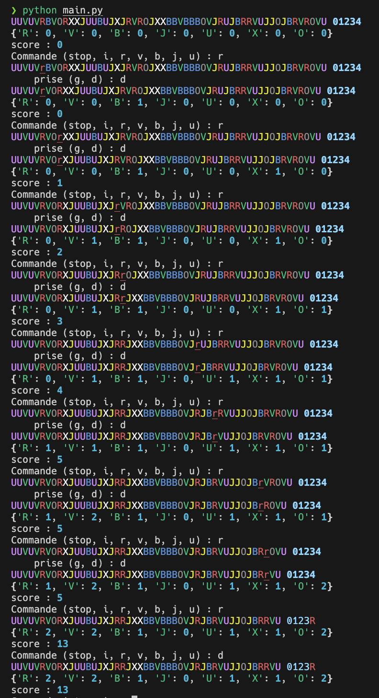

Le but de ce DS est de coder le magnifique jeu de plateau _Big Points_.



- [Règles en français du Big Points](https://www.associationallee.fr/wp-content/uploads/sites/2286/2019/06/big-points-regle.pdf)
- [Youtube en anglais de BGG](https://www.youtube.com/watch?v=BhSF6KzENtM) (pas pendant le DS...)



Le jeu n'est plus trouvable en l'état et c'est dommage. La version actuelle, moins abstraite et avec plus de règles s'appelle [Bites](https://www.philibertnet.com/fr/allplay/109573-bites-644216939862.html).

On peut cependant encore jouer à bites en utilisant les règles originales du big points, ouf !


Commencez par lire rapidement la règle avant de vous lancer dans le sujet proprement dit.


## Rendu

Le rendu du DS consiste en deux parties :

1. **le code** que vous êtes parvenu à rendre [sur Amétice](https://ametice.univ-amu.fr/mod/assign/view.php?id=4084092).
2. **un écrit** regroupant les différentes questions hors code.

### Code

Le code évoluera au fil des questions, c'est normal. Ne rendez que la version finale de celui-ci. En revanche, **il est indispensable d'avoir du code fonctionnel**.


Avant chaque nouvelle question, sauvegardez votre code actuel pour pouvoir y revenir si besoin.


Le code est constitué de trois fichiers :

- le programme principal : `main.py`{.fichier}
- les classes : `classes.py`{.fichier}
- les tests des classes : `test_classes.py`{.fichier}

Chaque question est bâtie sur la question précédente pour au final arriver à un jeu fonctionnel. Il est donc indispensable de finir la question précédente avant de passer à la suite.

### Texte

Chaque question aura une partie à coder et une partie textuelle. Vous rendrez cette dernière sur une feuille à part.

## Q1

### Q1.1 : texte


Quelle est la fonction de chaque partie d'un programme (programme principal, classes et tests) ?


Quelle est la partie la plus importante ?


### Q1.2 : code

Pour l'instant, votre programme doit consister en un seul fichier `main.py`{.fichier} dont le but est d'afficher une piste sur le terminal et à la mélanger plusieurs fois pour observer le résultat du mélange.

Le fichier `main.py`{.fichier} doit contenir la boucle suivante, qui affiche le plateau et permet de mélanger la piste :

```python
r = ""
random.shuffle(piste)

while r != "stop":
    print(plateau(piste))
    r = input("Commande (stop, i) : ")
    if r == "i":
        random.shuffle(piste)

```

0n choisit de représenter chaque disque par une lettre représentant sa couleur : `O`{.language-} et `X`{.language-} pour noir et blanc, `R`{.language-}, `V`{.language-}, `B`{.language-}, `J`{.language-} et `U`{.language-} pour rouge, vert, bleu, jaune, violet, respectivement.


Complétez le fichier `main.py`{.fichier} :

- gérez les imports
- créez la liste `piste`
- créez la fonction `plateau`

Pour pouvoir l'exécuter et obtenir le résultat ci-après (aux tirages aléatoires près).



## Q2

La question Q1 était là pour poser les bases du projet. On va maintenant pouvoir bâtir les classes (et leurs tests) permettant de le mener à bien.

### Q2.1 : texte


Quel est le but des méthodes python commençant et finissant par `__`{.language-} (2 underscore) ?


Quel est le but de `__str__`{.language-} ?



Proposez une modélisation UML des classes `Plateau`, `Piste` `Jeton` et `Podium` telle que

- la classe suivante fonctionne :

  ```python
  class Plateau:
      def __init__(self):
          self.piste = Piste()
          self.piste.melange()
          self.podium = Podium()

      def __str__(self):
          s = str(self.piste)
          s += " "
          s += str(self.podium)

          return s
  ```

- ces tests passent :

    ```python
    from classes import Jeton, Piste


    def test_jeton():
        jeton = Jeton("R")
        assert jeton.couleur == "R"


    def test_piste():
        piste = Piste()

        couleurs = {"R": 0, "V": 0, "B": 0, "J": 0, "U": 0, "X": 0, "O": 0}
        for x in piste.jetons:
            assert isinstance(x, Jeton)
            couleurs[x.couleur] += 1
        assert couleurs == {"R": 9, "V": 9, "B": 9, "J": 9, "U": 9, "X": 5, "O": 5}

    ```

- la classe `Podium`{.language-} soit la plus simple possible
- et le main suivant fonctionne :

    ```python
    from classes import Plateau

    plateau = Plateau()

    r = ""

    while r != "stop":
        print(str(plateau))
        r = input("Commande (stop, i) : ")
        if r == "i":
            plateau.piste.melange()

    ```



### Q2.2 : code


Modifier le fichier `main.py`{.fichier} et créez le fichier `test_classes.py`{.fichier} comme demandé dans la questions Q2.1


Coder les différentes classes dans le fichier `classes.py`{.fichier} pour que le programme fonctionne et soit cohérent avec votre réponse à la question Q2.1.



Quel test proposeriez-vous pour la méthode `Piste.melange` ? Le coder.


## Q3

Mettons de la couleur !


### Q3.1 : texte


Explicitez comment installer de nouveaux modules à python.


Comme s'assure-t-on que l'on a bien installé les module pour l'interpréteur de son choix ?


### Q3.2 : code


Installez le module [rich](https://github.com/Textualize/rich)


Le module rich permet de [remplacer la fonction print de python](https://github.com/Textualize/rich?tab=readme-ov-file#rich-print) en quelque chose qui supporte la couleur :

- utiliser du texte colorisé : <https://rich.readthedocs.io/en/latest/markup.html>
- liste des couleurs : <https://rich.readthedocs.io/en/latest/appendix/colors.html>



Ajoutez l'import de print du module rich dans le programme principal et modifiez les méthodes `__str__` des classes pour ajouter de la couleur comme dans l'image du début de la question.



## Q4

Gestion des déplacements des pions. Le rendu du déplacement doit permettre ça :


- on montre qu'un pion est sur un jeton en l'écrivant en minuscule.
- lorsqu'un pion arrive sur le podium, on remplace le numéro par la couleur du pion arrivé.

### Q4.1 : texte

### Q4.1.1


Qu'est-ce qu'un dictionnaire python et comment l'utilise-t-on ?


Quel est son utilité ?


### Q4.1.2

Le nouveau code de la classe `Plateau` sera :

```python
class Plateau:
    def __init__(self):
        self.piste = Piste()
        self.piste.melange()
        self.podium = Podium()
        self.pions = {"R": -1, "V": -1, "B": -1, "J": -1, "U": -1}

    def __str__(self):
        s = str(self.piste)
        s += " "
        s += str(self.podium)

        return s

    def deplace(self, couleur):
        if self.pions[couleur] is not None:  # pas encore le podium
            if self.pions[couleur] > -1:
                self.piste.jetons[self.pions[couleur]].pion = False

            self.pions[couleur] = self.piste.suivant(couleur, self.pions[couleur])

            if self.pions[couleur] is None:  # va sur le podium
                self.podium.ajoute(couleur)
            else:  # ajoute le pion sur le jeton
                self.piste.jetons[self.pions[couleur]].pion = True

```


Explicitez en quelques mots comment est sensé fonctionner `Plateau.deplace`{.language-}.


### Q4.2 : code

#### Q4.2.1


Ajouter la méthode `Plateau.deplace`{.language-} à votre code.



Codez la méthode `Piste.suivant`{.language-} qui doit fonctionner en accord avec `Plateau.deplace`{.language-} et de telle sorte que le test ci-après (que vous ajouterez à vos tests) fonctionne.



```python
def test_piste_suivant():
    piste = Piste()
    piste.jetons = [Jeton("V"), Jeton("R"),  Jeton("J"), Jeton("R")]

    assert piste.suivant("V", -1) == 0
    assert piste.suivant("R", 1) == 3
    assert piste.suivant("B", 0) is None

```

#### Q4.2.2



Codez la méthode `Podium.ajoute`{.language-} ainsi que son test.



#### Q4.2.3



Modifiez le fichier `main.py`{.fichier} pour que l'on puisse déplacer les jetons comme dans l'image du début de la question Q4.


## Q5

Pour terminer les déplacements, il faut pouvoir supprimer un jeton de la piste.

### Q5.1 : texte

Après avoir déplacé un pion, le joueur peut prendre un jeton à gauche ou à droite de celui-ci.


Explicitez en quelques phrases l'algorithme permettant de déterminer ces jetons.


### Q5.2 : code



Codez la méthode `Piste.gauche_droite`{.language-} qui implémente l'algorithme de la question Q5.1. Cette méthode :

- a comme paramètre un indice $i$ de la piste
- doit rendre un couple `(gauche, droite)`{.language-} correspondant aux indices gauche et droite des jetons que peut prendre le joueur ayant déplacé son pion sur le jeton d'indice i.

Elle doit faire passer le test ci-après qui explicite son fonctionnement, en particulier si une prise est impossible (pas de jeton prenable à gauche ou à droite).


```python
def test_piste_gauche_droite():
    piste = Piste()
    piste.jetons = [Jeton("V"), Jeton("R"),  Jeton("J"), Jeton("R")]

    assert piste.gauche_droite(0) == (None, 1)
    assert piste.gauche_droite(3) == (2, None)
    assert piste.gauche_droite(2) == (1, 3)
    piste.jetons[1].pion = True
    assert piste.gauche_droite(2) == (0, 3)
    piste.jetons[0].pion = True
    assert piste.gauche_droite(2) == (None, 3)

```



Utilisez-la dans le fichier `main.py`{.fichier} pour ajouter la fonctionnalité de prise d'un jeton après déplacement.

Une proposition d'interface pour réaliser ceci :




## Q6

On suppose maintenant qu'il existe un joueur qui récupère les jeton pris.


Ajoutez une classe `Joueur`{.language-} permettant de contenir les jetons en possession du joueur.



Affichez la liste des jetons en possession du joueur après chaque coup joué. Par exemple comme ça :




## Q7


Ajoutez à l'affichage les points actuellement possédés par le joueur. Vous coderez pour cela une méthode `Joueur.points`{.language-} prenant le podium comme argument.


Exemple d'interface :



## Q8

Pour aller plus loin vous pouvez vous attelez à coder :

1. la gestion du jeton noir
2. le jeu à deux joueurs
3. ...
