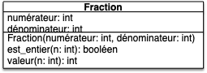
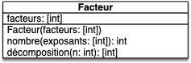
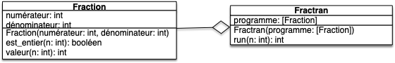


- Vous avez 30min pour faire le test.
- Vous pouvez pair-programmer (si vous le faites, ajoutez un fichier `participant.txt`{.language-} qui contient les noms et prénoms des participants)


## Rendu

On vous rappelle que toute fonction (hors du programme principal) doit être testée.

### Type de rendu

Vous devrez rendre le dossier d'un projet vscode (vous pouvez le compresser si nécessaire). Commencez donc par créer un projet dans un dossier que vous appellerez `la-POO-C-bo`{.fichier}.

### Éléments de notation

1. 3 fichiers dans un projet :
    - le programme principal `main.py`{.fichier},
    - les fonctions utilisées `fractran.py`{.fichier},
    - les tests des fonctions `test_fractran.py`{.fichier}.
2. Du joli code : le code doit être passé par black.
1. Bons noms :
    - de fichiers,
    - de variables.
2. Tests unitaires : toute fonction doit être testée.

## Sujet


Le but du sujet est de construire un ordinateur !


On utilisera pour cela [le FRACTRAN](https://fr.wikipedia.org/wiki/FRACTRAN) qui est un langage de programmation inventé par John Conway (à qui l'on doit aussi le célèbre [jeu de la vie](https://fr.wikipedia.org/wiki/Jeu_de_la_vie)). Nous allons y aller pas à pas, il suffit de suivre les différentes étapes.

### Fractions

On va commencer par coder une classe `Fraction`{.language-} dont le diagramme UML est :



- La méthode `Fraction.est_entier(n)`{.language-} rend un booléen qui est :
  - `Vrai`{.language-} si le dénominateur de la fraction divise `n`{.language-}
  - `Faux`{.language-} si le dénominateur de la fraction ne divise pas `n`{.language-}
- La méthode `Fraction.valeur(n)`{.language-} rend l'entier résultant de la multiplication du numérateur et de la division entière entre `n`{.language-} et le dénominateur

Les tests suivant explicitent ce fonctionnement :

```python
from fractran import Fraction


def test_Fraction_init():
    assert Fraction(1, 2).numérateur == 1
    assert Fraction(1, 2).dénominateur == 2


def test_Fraction_est_entier():
    assert Fraction(1, 2).est_entier(2)
    assert not Fraction(1, 3).est_entier(2)


def test_Fraction_valeur():
    assert Fraction(3, 2).valeur(4) == 3 * (4 // 2)


```



Implémentez la classe la classe `Fraction`{.language-} dans le fichier `fractran.py`{.fichier} et ses tests dans le fichier `test_fractran.py`{.fichier}.



Vous pourrez utiliser le fait qu'en python :
- `a // b`{.language-} rend la division entière de `a`{.language-} par `b`{.language-},
- `a % b`{.language-} rend le reste de la division entière  de `a`{.language-} par `b`{.language-}.


### Facteurs

Le langage FRACTAN s'utilise en utilisant la décomposition en facteurs premiers des nombres. On doit donc créer une classe permettant de passer d'un nombre à une décomposition (partielle) en facteurs premiers et réciproquement. Pour cela on crée une classe `Facteur`{.language-} dont le diagramme UML est :



- La méthode `Facteur.nombre(L)`{.language-} rend un entier qui vaut le produits des $\text{facteur}[i]^{L[i]}$ pour $0 \leq i < \text{len}(L)$

- La méthode `Fraction.décomposition(n)`{.language-} rend la liste $L$ qui est la décomposition de $n$ selon les facteurs stockées dans `self.facteurs`{.language}. C'est à dire que le retour $L$ de la méthode est telle que $n$ est divisible par $\text{facteur}[i]^{L[i]}$ mais pas par $\text{facteur}[i]^{L[i] + 1}$ pour tout $0 \leq i < \text{len}(\text{facteur})$.

Les tests suivant explicitent ce fonctionnement :

```python
from fractran import Facteur


def test_Facteur_init():
    assert Facteur([2, 3, 7]).facteurs == [2, 3, 7]


def test_Facteur_nombre():
    assert Facteur([2, 3, 7]).nombre([1, 2]) == (2 ** 1) * (3 ** 2)
    assert Facteur([2, 3, 7]).nombre([1, 2, 3]) == (2 ** 1) * (3 ** 2) * (7 ** 3)


def test_Facteur_décomposition():
    assert Facteur([2, 3, 7]).décomposition(1) == [0, 0, 0]
    assert Facteur([2, 3, 7]).décomposition((2**3) * (3**2) * (7)) == [3, 2, 1]

```


Implémentez la classe `Facteur`{.language-} dans le fichier `fractran.py`{.fichier} et ses tests dans le fichier `test_fractran.py`{.fichier}.



Vous pourrez utiliser le fait qu'en python  `a ** b`{.language-} rend $a^b$.


### Fractran


Le Fractran est un langage de programmation où un programme est une liste finie de fractions :

<div>
$$
P = [\frac{p_0}{q_0}, \cdots, \frac{p_i}{q_i}, \cdots, \frac{p_{l-1}}{q_{l-1}} ]
$$
</div>

Son exécution nécessite un paramètre d'entrée $n$ et se déroule comme suit :

- Tant qu'il existe $i$ tel que $q_i$ divise $n$, on pose $n \leftarrow n \cdot \frac{p_{i^\star}}{p_{i^\star}}$ avec $i^\star$ le plus petit indice $i$ tel que $q_i$ divise $n$.
- Lorsqu'il n'existe plus d'indice $i$ tel que $q_i$ divise $n$, le programme s'arrête et rend $n$.


Par exemple si $P = [\frac{3}{10}, \frac{4}{3}]$ alors $P(14) = 14$ (aucun dénominateur ne divise 14) et $P(15) = 8$ (3 divise 15 ; 10 divise 20 ; 3 divise 6 ; aucune fraction ne divise 8).

Le code suivant (écrit dans `fractran.py`{.fichier}) implémente cette idée :

```python
class Fractran:
    def __init__(self, fractions):
        self.programme = fractions

    def run(self, n):
        i = 0
        while i < len(self.programme):
            if self.programme[i].est_entier(n):
                n = self.programme[i].valeur(n)
                i = 0
            else:
                i += 1
        return n
    
```

Et est basé sur l'uml suivant :





Ajoutez le code de la classe dans le fichier `fractran.py`{.fichier} et implémentez des tests de celle-ci dans le fichier `test_fractran.py`{.fichier}.



## Programme Principal

Montrons un peu que le Fractran est un vrai langage de programmation en exhibant les programmes qui permettent de calculer [la somme](https://fr.wikipedia.org/wiki/FRACTRAN#Addition) et [le produit](https://fr.wikipedia.org/wiki/FRACTRAN#Multiplication) de deux entiers.


Créez un fichier `main.py`{.fichier} où vous :

1. copierez le code suivant,
2. ajouterez des commentaires explicitant son fonctionnement.



```python
from fractran import Fractran, Fraction, Facteur

facteurs = Facteur([2, 3, 5])

print("Somme :")
somme = [Fraction(3, 2)]
for i in range(10):
    for j in range(10):
        retour = Fractran(somme).run(facteurs.nombre([i, j]))
        décomposition = facteurs.décomposition(retour)
        print(i, "+", j, "=", décomposition[1], "(retour =", retour, "; décomposition =", décomposition,")")


print("Produit :")
produit = [Fraction(455, 33), Fraction(11, 13), Fraction(1, 11), Fraction(3, 7), Fraction(11, 2), Fraction(1, 3)]
for i in range(10):
    for j in range(10):
        retour = Fractran(produit).run(facteurs.nombre([i, j]))
        décomposition = facteurs.décomposition(retour)
        print(i, "*", j, "=", décomposition[2], "(retour =", retour, "décomposition =", décomposition, ")")
```


## Pour aller pus loin

On peut faire des choses incroyable en Fractran, mais pour cela il faut considérer tous entiers générés par le programme au cours de son exécution et pas juste rendre le dernier.

Par exemple, 


Ajoutez à la classe `Fractran` une méthode de signature `Fractran.suite(n: int, N:int): [int]`{.language-}. Si $L$ est la liste rendue par la méthode elle doit être telle que :

- $\text{len}(L) \leq N$
- $L[0]$ soit le paramètre d'entrée $n$ de la méthode
- $L[i]$ soit le $i$ème entier généré par le programme.


Le paramètre $N$ garanti que tout programme va s'arrêter : on s'arrête après avoir généré $N-1$ entiers.


Par exemple si $P = [\frac{3}{10}, \frac{4}{3}]$ et $n=15$ :
- si $N \geq 4$ la méthode va rendre $[15, 20, 6, 8]$ 
- si $N = 2$ la méthode va rendre $[15, 20]$ 

Cette nouvelle méthode va nous permettre de générer [la suite de Fibonacci](https://fr.wikipedia.org/wiki/FRACTRAN#Suite_de_Fibonacci) ou encore [tous les nombres premiers](https://fr.wikipedia.org/wiki/FRACTRAN#Algorithme_de_Conway_des_nombres_premiers) en filtrant la liste sortie par l'algorithme.

### Suite de Fibonacci


Ajoutez dans le programme principal le code suivant et explicitez comment il fonctionne (je ne veux pas de preuve, juste une explication du code python) :

```python
print("Fibonacci rend les couples (F(n), F(n+1)) :")
fibonacci = [Fraction(23, 95), Fraction(57, 23), Fraction(17, 39), Fraction(130, 17), Fraction(11, 14), 
          Fraction(35, 11), Fraction(19, 13), Fraction(1, 19), Fraction(35, 2), Fraction(13, 7), 
          Fraction(7, 1)]

sortie_brute = Fractran(fibonacci).suite(3, 1000) 
sortie = []
for n in sortie_brute:
    if n == Facteur([2, 3]).nombre(Facteur([2, 3]).décomposition(n)):
        sortie.append(Facteur([2, 3]).décomposition(n))

print(sortie)

```



### Nombres premiers

Encore pus fort, la suite des nombres premiers !


Ajoutez dans le programme principal le code suivant et explicitez comment il fonctionne (je ne veux pas de preuve, juste une explication du code python) :

```python
print("Nombres premiers :")
crible = [Fraction(17, 91), Fraction(78, 85), Fraction(19, 51), Fraction(23, 38), Fraction(29, 33), 
          Fraction(77, 29), Fraction(95, 23), Fraction(77, 19), Fraction(1, 17), Fraction(11, 13), 
          Fraction(13, 11), Fraction(15, 14), Fraction(15, 2), Fraction(55, 1)]

sortie = [Facteur([2]).décomposition(n)[0] for n in Fractran(crible).suite(3, 100000) 
          if n == Facteur([2]).nombre(Facteur([2]).décomposition(n))]

print(sortie)
```

