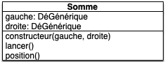

Vous devez rendre un dossier contenant les fichiers de ce test. Il contiendra :

* le fichier `dés.py`{.fichier} contenant les classes que l'on vous demande de créer
* le fichier `main.py`{.fichier} contenant le programme principal.



1. Faites les questions dans l'ordre.
2. on ne vous demande pas de tests dans ce test



Le but de ce test est de pouvoir réaliser des combinaisons de dés utiles en [jeu de rôle](https://fr.wikipedia.org/wiki/Jeu_de_r%C3%B4le_sur_table). On veut pouvoir par exemple utiliser des objets permettant de représenter :

* 1d6 + 1d20 (somme d'un jet d'un dé à 6 faces et d'un jet d'un dé à 20 faces)
* 3d6 (3 fois la valeur d'un jet d'un dé à 6 faces)
* ou des combinaisons des deux formes précédentes, comme : 3(2d6 + 1d6) + 1d20

## Question 1

```python
from random import randrange

class DéGénérique:
    def __init__(self, max, position=1):
        self._max = max
        self._position = position
    
    def position(self):
        return self._position
    
    def lancer(self):
        self._position = randrange(1, self._max + 1)

```

### Question 1.1


Implémentez les classes `D6`{.language-} et `D20`{.language-} pour qu'elles respectent le modèle UML ci-après :


On veut également que :

* les positions possibles d'un objet dé de type `D6`{.language-} soient entre 1 et 6
* les positions possibles d'un objet dé de type `D20`{.language-} soient entre 1 et 20


### Question 1.2

Dans le programme principal :



1. créez un d6 et un d20
2. affichez les positions des dés créés
3. lancez les
4. affichez les positions des dés créés



## Question 2

On veut pouvoir composer deux dés de façon à pouvoir :

* les lancer simultanément
* obtenir la somme de leurs valeurs respectives

Ceci doit être possible en utilisant une classe dont le schéma UML est :



### Question 2.1



Créez la classe `Somme`{.language-}.



### Question 2.2

Dans le programme principal :



Ajoutez :

1. créez une `Somme`{.language-} avec les deux dés que vous avez créés à la question précédente
2. affichez la position de la somme
3. lancez la
4. affichez la position de la somme



## Question 3

On veut lier `DéGénérique`{.language-} et `Somme`{.language-}.

### Question 3.1



Créez une méthode `DéGénérique.somme(other)`{.language-} qui prend un paramètre (`other`{.language-}) et rend une `Somme`{.language-} composée du dé appelant et du paramètre.



### Question 3.2



Modifiez le programme principal pour que la somme soit créée à partir de l'objet du type `D6`{.language-}



## Question 4

De plus en plus fort : des sommes de sommes sans seum.

### Question 4.1


Modifiez La classe `Somme`{.language-} en y ajoutant la méthode `Somme.somme(other)`{.language-} afin qu'il soit possible d'écrire le code suivant :

```python
un_d6 = D6()
un_autre_d6 = D6()
un_d20 = D20()

d6_plus_d6_plus_d20 = un_d6.somme(un_d20).somme(un_d6)
```



### Question 4.2

Dans le programme principal :



Ajoutez :

1. créez l'objet `d6_plus_d6_plus_d20`{.language-} de la question précédente
2. affichez la position de `d6_plus_d6_plus_d20`{.language-}
3. lancez le
4. affichez la position de `d6_plus_d6_plus_d20`{.language-}



## Question 5

Gestion de la multiplication. On a envie de pouvoir multiplier des positions de dés (ou de sommes) par un entier. En s'inspirant de `Somme`{.language-} on forme le schéma UML d'une classe `Fois`{.language-} qui permettrait de faire cela :


### Question 5.1



1. créez cette classe que vous nommerez `Fois`{.language-}
2. ajoutez la méthode `DéGénérique.fois(entier)`{.language-}  permettant de rendre des objets de la classe `Fois`{.language-} pour un dé
3. forgez la `Somme.fois(entier)`{.language-} permettant de rendre des objet de la classe `Fois`{.language-} à partir d'un objet `Somme.fois(entier)`{.language-}
4. ajoutez la méthode `Fois.fois()`{.language-} pour finir de lier `DéGénérique`{.language-}, `Somme`{.language-} et `Fois`{.language-} en un unique ensemble de classes permettant de faire la même chose.



### Question 5.2

Dans le programme principal :



1. utilisez le `D6`{.language-} et le `D20`{.language-} créés à la question 1.2 pour créer l'objet représentant : 3 * (1d6 + 1d20)
2. affichez sa position
3. lancez le
4. affichez sa position



## Facultatif


Ne fait pas partie du test. C'est juste pour terminer l'exercice.


A faire ce soir au calme pour préparer vos futures parties de JdR.

### Dégâts constants

Un marteau enchanté fait : 1d6 + 4 dégâts. Il est pour l'instant impossible de gérer ceci avec nos objets, car un entier n'a pas de méthode `position()`{.language-} ni `lancer()`{.language-}.

Une solution simple pour résoudre ce problème est de transformer notre entier en un dé constant.



Créez une classe `Cte`{.language-} qui :

* hérite de `DéGénérique`{.language-}
* se construit en donnant explicitement une position
* la méthode `Cte.lancer()`{.language-} ne modifie pas sa position (lorsque vous redéfinissez une méthode dans une classe fille, vous n'êtes pas obligé de rappeler la méthode de la classe mère)



Il suffit maintenant d'intercepter les entiers qui peuvent arriver dans nos expressions et de les transformer en constante.


Dans les méthodes `.somme(other)`{.language-}, transformez le paramètre `other`{.language-} s'il est entier en un objet de type `Cte()`{.language-} (vous pourrez utiliser [`isinstance(other, int)`{.language-}](https://docs.python.org/fr/3/library/functions.html?highlight=hasattr#isinstance) pour savoir si `other`{.language-} est un entier)



Testons tout ça dans le programme principal :


Créez un objet simulant les dégâts d'un marteau magique puis faites un jet de dommage et affichez sa valeur.


### Méthodes spéciales

On aimerait pouvoir écrire des choses du type :

```python
dés = 3 * D6() + D20()
```

Pour cela, on connaît deux méthodes spéciales :

* `__add__`{.language-} qui permet de gérer l'addition
* `__mul__`{.language-} pour gérer la multiplication

Mais `__mul__`{.language-} ne permet pas d'écrire `3 * Dé()`{.language-} car cette expression est transformée en `(3).__mul__(Dé())`{.language-} qui rend une erreur (l'erreur est `TypeError`{.language-}). Pour ce genre de cas où `A.__mul__(B)`{.language-} produit une erreur mais où `B.__mul__(A)`{.language-} fonctionnerait, on peut utiliser `__rmul__`{.language-}.

En effet, pour calculer `A * B`{.language-} python fait plusieurs essais :

1. il essaye `A.__mul__(B)`{.language-}
2. si l'expression précédente rend une erreur de type `TypeError`{.language-} alors python tente `B.__rmul__(A)`{.language-}



1. implémentez les méthodes `DéGénérique.__add__(other)`{.language-}, `Somme.__add__(other)`{.language-} et `Fois.__add__(other)`{.language-} pour remplacer les méthodes `.somme(other)`{.language-}
2. implémentez les méthodes `DéGénérique.__rmul__(other)`{.language-}, `Somme.__rmul__(other)`{.language-} et `Fois.__rmul__(other)`{.language-} pour remplacer les méthodes `.fois(other)`{.language-}
3. modifiez le codes du fichier `main.py`{.fichier} pour qu'il utilise `+`{.language-} et `*`{.language-} à la place de `somme()`{.language-} et `fois()`{.language-}



### Conclusion

Vous pouvez maintenant écrire et évaluer des expressions du style : `3 * D6() + 4 + 3 * (D20() + D6())`{.language-}. Sympa, non ?
