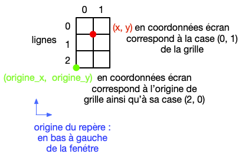
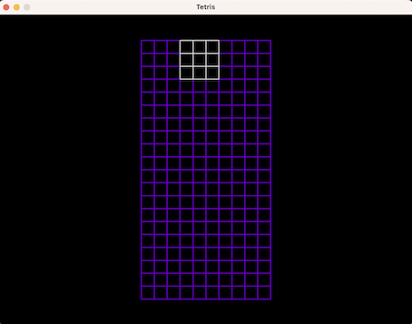
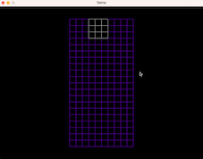
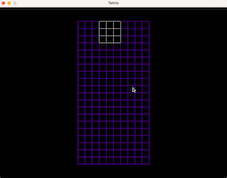
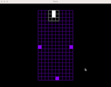
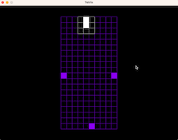
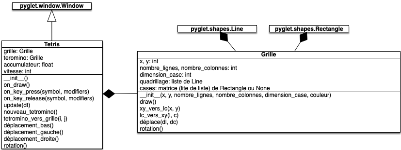
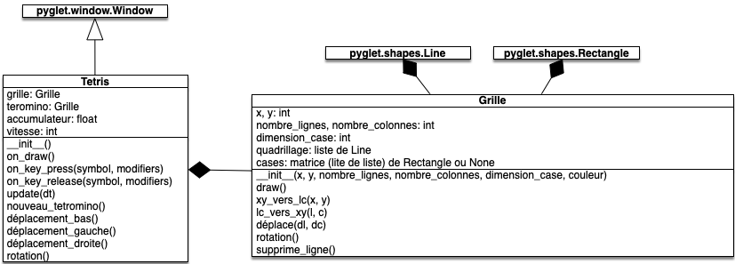
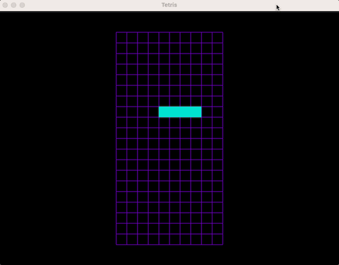
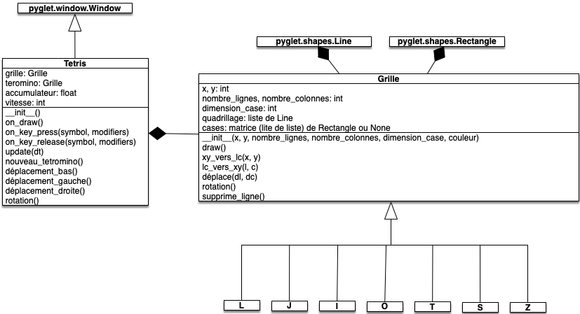

Le but de ce DS est de coder un Tetris.



**Durée du contrôle** : 2h50min.

1. Faites les questions dans l'ordre
2. n'inventez pas votre propre structure, suivez celle demandée
3. rendez sur [Amétice](https://ametice.univ-amu.fr/mod/assign/view.php?id=2978329) un dossier contenant tout votre code ainsi qu'un fichier texte contenant les numéros des questions auxquelles vous avez répondu



Vous aurez besoin de la bibliothèque [pyglet](https://pyglet.readthedocs.io/en/latest/) pour coder les fenêtres et de [pytest](https://docs.pytest.org/) pour tester les fonctions utilitaires.


Toutes les informations nécessaires pour ce DS ont été prises du site [hard drop](https://harddrop.com/wiki/Tetris_Wiki) qui contient toutes les ressources nécessaires pour comprendre et devenir meilleur à Tetris.


## Question 1


Construire avec [pyglet](https://pyglet.readthedocs.io/en/latest/) une fenêtre qui doit être semblable à celle ci-dessous :




Pour cela, vous respecterez le schéma UML suivant :


Informations :

* les paramètres `x`{.language-} et `y`{.language-} du constructeur de `Grille`{.language-} correspondent à l'origine de la grille dans le repère de la fenêtre, ici (275, 50)
* la méthode `on_draw()`{.language-} de la classe `Tetris`{.language-} exécute la méthode `draw()`{.language-} de son attribut `grille`{.language-}
* la méthode `draw()`{.language-} de la classe `Grille`{.language-} exécute la méthode `draw()`{.language-} de chaque élément de son attribut `quadrillage`{.language-}
* les éléments [Line](https://pyglet.readthedocs.io/en/latest/modules/shapes.html?highlight=pyglet.Shapes.Line#pyglet.shapes.Line) de l'attribut `quadrillage`{.language-} des objets de type `Grille`{.language-} permettent de dessiner le quadrillage de ceux-ci

Vous implémenterez :

* la classe `Tetris`{.language-} dans un fichier nommé `tetris.py`{.fichier}
* la classe `Grille`{.language-} dans un fichier nommé `grille.py`{.fichier}
* le programme principal dont le but est d'ouvrir la fenêtre Tetris dans un fichier nommé `main.py`{.fichier}

## Question 2

Avant de créer les [tetrominos](https://harddrop.com/wiki/Tetromino) proprement dit, on va commencer par les simuler par une grille.

### Question 2.1


Fonctions utilitaires de conversion.


Tout au long de ce projet, il faudra jongler entre les coordonnées (x, y) de la fenêtre et les coordonnées en ligne et colonne de la grille ou du tetromino. La figure ci-dessous montre les correspondances :



L'origine du repère de la fenêtre est en bas à gauche et toutes les formes pyglet dépendent d'elle, c'est ce que l'on appelle les *coordonnées écrans* (x, y) alors que chaque grille est organisée en *coordonnées matricielles* (ligne, colonne).

Créez un fichier `utils.py`{.fichier} où vous copierez les deux fonctions ci-dessous :

```python
def xy_vers_lc(x, y, origine_grille_x, origine_grille_y, dimension_case, nombre_lignes_grille):
    ligne = nombre_lignes_grille - 1 - (y - origine_grille_y) // dimension_case
    colonne = (x - origine_grille_x) // dimension_case

    return (ligne, colonne)


def lc_vers_xy(ligne, colonne, origine_grille_x, origine_grille_y, dimension_case, nombre_lignes_grille):
    x = origine_grille_x + dimension_case * colonne
    y = origine_grille_y + dimension_case * (nombre_lignes_grille - 1 - ligne)

    return (x, y)
```

Ces deux fonctions permettent de faire les conversions entre les coordonnées écrans et matricielles :

* `xy_vers_lc`{.language-} permet, à partir d'une coordonnée écrans `x`{.language-} et `y`{.language-} correspondant à un coin bas gauche d'une case de rendre la ligne et la colonne de celle ci dans grille. Par exemple si on rentre comme paramètres :
  * les coordonnées du disque rouge, la fonction rend (0, 1)
  * les coordonnées du disque noir, la fonction rend (2, 0)
* `lc_vers_xy`{.language-} permet, à partir d'une ligne et d'une colonne `l`{.language-} et `c`{.language-}, de rendre les coordonnées écrans du coin bas gauche de cette case. Par exemple si on rentre comme paramètres :
  * (0,1), la fonction rend les coordonnées du disque rouge
  * (2,0), la fonction rend les coordonnées du disque noir

Ces fonctions nécessitent les paramètres suivants :

* `origin_x`{.language-} et `origin_y`{.language-} : l'origine de la grille en coordonnées écrans. C'est le disque noir de la figure
* `dimension_case`{.language-} : la hauteur d'une case en pixel (25 pour notre programme)
* `nombre_lignes_grille`{.language-} : le nombre de lignes de la grille

Vous testerez ces deux fonctions dans le fichier `test_utils.py`{.fichier}, en vérifiant que :

* si :
  * l'origine de la grille est en (275, 50)
  * la dimension d'une case est 25
  * la grille a 3 lignes et deux colonnes
* alors :
  * la case en bas à gauche de la grille (de coordonnées matricielles (2, 0)) a comme coordonnée écrans (275, 50)
  * la case en haut à droite de la grille (de coordonnées matricielles (0, 1)) a comme coordonnée écrans (300, 100)

### Question 2.2


Intégration des utilitaires.


Ajoutez à la classe `Grille`{.language-} les deux méthodes :

* `Grille.lc_vers_xy(x, y)`{.language-} permettant rendre les coordonnées écran à partir des coordonnées matricielles passées en paramètres
* `Grille.xy_vers_lc(l, c)`{.language-} permettant rendre les coordonnées matricielles à partir des coordonnées écrans passées en paramètres

Vous utiliserez pour cela les fonctions `lc_vers_xy`{.language-} et `xy_vers_lc`{.language-} du fichier `utils.py`{.fichier}.

### Question 2.3


Créer un tetromino fictif qui nous permettra de mettre en place la logique interne du jeu.


Ajoutez un attribut `tetromino`{.language-} aux objets de type `Tetris`{.language-}. Cet attribut sera une `Grille`{.language-} :

* de 3 lignes et 3 colonnes
* de dimension de case est la même partout (grille et tetromino) et correspond à celle passée en paramètre du constructeur de la classe `Grille`{.language-}
* la position de l'origine correspond aux coordonnées écrans de la case de coordonnées matricielles (2, 3) de l'attribut `grille`{.language-}
* de couleur blanche (255, 255, 255)



### Question 2.4



Mettez en place le moteur du jeu qui doit s'exécuter 60 fois par seconde.

Ce moteur doit pouvoir faire descendre l'attribut `tetromino`{.language-} des objets de type `Tetris`{.language-} d'une case vers le bas par seconde. Lorsque l'origine du tetromino touche le sol (le bas de la grille), il disparaît au bout de 500ms (ce temps d'attente est appelé *lock delay*). Il est remplacé par un nouveau tetromino placé à la position d'origine et le cycle recommence.


Pour cela, il vous sera nécessaire :

* de créer la méthode `Tetris.update(dt)`{.language-} qui s'exécutera 60 fois par seconde
* d'ajouter une méthode `Grille.déplace(dl, dc)`{.language-} qui déplacera le tetromino de $dl$ lignes et $dc$ colonnes (n'oubliez pas de déplacer les éléments du quadrillage)
* d'ajouter un attribut `accumulateur`{.language-} aux objets de type `Tetris`{.language-} dont le but est de mesurer le temps passé depuis la dernière action. À chaque mise à jour du moteur le paramètre `dt`{.language-} est ajouté à l'accumulateur et après une action réussie (une descente si l'accumulateur vaut 1 seconde ; un lock delay après un délai de 500ms), l'accumulateur est remis à 0
* d'ajouter une méthode `Tetris.nouveau_tetromino()`{.language-} qui place dans l'attribut `tetromino`{.language-} un nouveau tetromino placé aux coordonnées matricielles (2, 3) de la grille. Utilisez cette méthode à chaque fois que vous créez un tetromino (dont le premier, dans le constructeur)


### UML 2

À la fin de la question 2, vous devez avoir l'UML suivant :


## Question 3

Gestion des touches de déplacements horizontaux, d'accélération et de chute.

### Question 3.1


Lorsque l'on appuie sur la barre d'espace (*hard drop*), le tetromino est directement placé sur le sol s'il n'y était pas déjà.


Le *hard drop* étant une action, après un *hard drop* réussi, l'accumulateur est remis à zéro.


### Question 3.2


Déplacements horizontaux du tetromino avec les touches "⇦" et "⇨".



Pour cela, il vous sera nécessaire de faire en sorte que :

* lorsque l'on appuie sur la touche "⇦" (flèche gauche) du clavier, le tetromino se déplace d'une case vers la gauche si c'est possible (la colonne de la case de la grille correspondant à l'origine du tetromino est strictement positive)
* lorsque l'on appuie sur la touche "⇨" (flèche droite), le tetromino se déplace d'une case vers la droite si c'est possible (la colonne de la case de la grille correspondant à l'origine du tetromino plus son nombre de colonnes est strictement plus petite que le nombre de colonnes de la grille)

Le déplacement horizontal étant une action, après un déplacement horizontal réussi, l'accumulateur est remis à zéro.




Remettre l'accumulateur à zéro après un déplacement horizontal réussi permet si on est assez rapide de se [déplacer indéfiniment](https://harddrop.com/wiki/Infinity) de gauche à droite sans jamais descendre. Prenez ça comme une feature plutôt qu'un bug.


### Question 3.3


Lorsque l'on appuie sur la touche "⇩", la vitesse du tetromino passe à 20 cases par secondes (*soft drop*). La vitesse revient à la normale (1 case par seconde) lorsque la touche est relâchée.


Pour cela, il vous sera nécessaire :

* d'ajouter un attribut `vitesse`{.language-} aux objets de type `Tetris`{.language-} dont la valeur pourra être $1$ ou $20$
* de prendre en compte celle-ci lorsque l'on décide si le tetromino doit descendre d'une case (la vitesse multipliée par l'accumulateur doit être plus grand que 1)



### UML 3

À la fin de la question 3, vous devez avoir l'UML suivant :


## Question 4

Créer un tetromino quelconque.

### Question 4.1


La grille doit être composée de cases.


#### Question 4.1.1

Nous ajoutons un attribut `cases`{.language-} aux objets de type `Grille`{.language-}. Cet attribut est une matrice aux dimensions de la grille permettant de gérer individuellement chaque case de la grille.

 Le code suivant crée cet attribut en remplissant chaque case avec des objets `None`{.language-} :

```python
class Grille:
    def __init__(self, x, y, nombre_lignes, nombre_colonnes, dimension_case, couleur):
        # ..

        self.cases = []
        for i in range(nombre_lignes):
            ligne = []
            for j in range(nombre_colonnes):
                ligne.append(None)
            self.cases.append(ligne)

        # ...
```

Chaque élément, noté `cases[ligne][colonne]`{.language-}, sera ensuite :

* soit `None`{.language-} et la case est *libre*
* soit un objet de type [`pyglet.shapes.Rectangle`{.language-}](https://pyglet.readthedocs.io/en/latest/modules/shapes.html#pyglet.shapes.Rectangle) remplissant la case et la case est *occupée*

Ajoutez la création de cet attribut à votre classe `Grille`{.language-} et mettez à jour les méthodes suivantes :

* `Grille.draw()`{.language-} pour qu'elle dessine les cases occupées de l'attribut `cases`{.language-}
* `Grille.déplace(dl, dc)`{.language-} pour qu'elle change également la position des cases occupées de l'attribut `cases`{.language-}


On modifiera le statut des cases (libre ou occupée) après la création de l'objet. Le constructeur s'occupe juste de créer des cases libres.


#### Question 4.1.2


Création d'un tetromino.


Modifiez la méthode `Tetris.nouveau_tetromino()`{.language-} pour que la grille du tetromino ait la forme ci-dessous ('·' signifie que la case est libre et '□' qu'elle est occupée) :

```
·□·
·□·
···
```

Pour cela, dans la méthode `Tetris.nouveau_tetromino()`{.language-} et une fois la grille du tetromino créé, vous changerez dans les cases de son attribut `cases` qui doivent être occupées en leur affectant un [`pyglet.shapes.Rectangle`{.language-}](https://pyglet.readthedocs.io/en/latest/modules/shapes.html#pyglet.shapes.Rectangle)



Pour l'instant le quadrillage de la grille du tetromino est affichée et le tetromino en lui-même disparaît alors qu'il ne touche pas lui-même le sol.

Pas d'inquiétude, nous réglerons ça bientôt.


### Question 4.2

Gestion de la rotation des tetromino avec la touche "⇧".

#### Question 4.2.1


Utilitaire de rotation de matrice.


Commencez par coder une fonction `rotation(matrice_carrée)`{.language-} dans le fichier `utils`{.fichier} qui rend la matrice carrée correspondant à la matrice donnée en entrée tournée d'un quart de tour.

Vous testerez dans `test_utils`{.fichier} que si l'on donne en entrée la matrice :

```python
[[1, 2, 3],
 [4, 5, 6],
 [7, 8, 9]]
```

On obtient la matrice suivante en sortie :

```python
[[7, 4, 1],
 [8, 5, 2],
 [9, 6, 3]]
```

#### Question 4.2.2


Intégration de l'utilitaire à la classe  `Grille`{.language-} et gestion de la touche "⇧" dans la classe `Tetris`{.language-}.


Utilisez la fonction `rotation`{.language-} du fichier `utils`{.fichier} pour implémenter une méthode `Grille.rotation()`{.language-} qui :

* tourne l'attribut `cases`{.language-} d'un quart de tour vers la droite si la grille est carrée.
* ne fait rien si la grille n'est pas carrée.

Utilisez cette méthode lorsque l'on appuie sur la touche "⇧" (flèche haut).

La rotation étant une action, l'accumulateur est remis à zéro après une rotation.


### UML 4

À la fin de la question 4, vous devez avoir l'UML suivant :


## Question 5

Gestion des collisions.

### Question 5.1


Placer des obstacles sur la grille pour tester nos futures méthodes.


Ajouter des Rectangles aux cases (10, 0), (10, 9)  et (0, 5) de l'attribut `grille`{.language-} de la classe `Tetris`{.language-}.


### Question 5.2

On traite les déplacements possibles un à un.

#### Question 5.2.1


Passer du tetromino à la grille.


Créez une méthode `Tetris.tetromino_vers_grille(i, j)`{.language-} qui prend en paramètres les coordonnées matricielles d'une case du `tetromino`{.language-} et rend les coordonnées matricielles de la même case mais en tant que case de la `grille`{.language-}.

#### Question 5.2.2


Gérer les descentes normales et en *soft drop*.


Pour chaque colonne, on regarde si la dernière case occupée de la colonne peut se déplacer (elle n'est pas sur le sol et la case en dessous d'elle est libre).

Si toutes les colonnes sont OK, on peut déplacer le tetromino vers le bas. Sinon le tetromino est bloqué et la phase de *lock delay commence*.

Pour cela, il vous sera nécessaire d'ajouter une méthode `Tetris.déplacement_bas()`{.language-} qui rend `True`{.language-} si le déplacement bas est possible et `False`{.language-} sinon



#### Question 5.2.3


Gérer les *hard drop*.


Vous pourrez enchaîner les descentes d'une case dans une boucle `while`{.language-} jusqu'à être bloqué.


#### Question 5.2.4


Gérer les mouvements de 1 case vers la gauche ou la droite.


On peut réutiliser la technique utilisée pour la descente d'une case.

Pour chaque ligne, selon le déplacement, on regarde si la première case occupée (déplacement vers la gauche) ou la dernière case occupée (déplacement vers la droite) de la ligne peut se déplacer (elle n'est pas au bord et la case vers laquelle elle veut se déplacer est libre).

Si toutes les lignes sont OK, on peut déplacer le tetromino.

Pour cela, il vous sera nécessaire :

* d'ajouter une méthode `Tetris.déplacement_gauche()`{.language-} qui rend `True`{.language-} si le déplacement gauche est possible et `False`{.language-} sinon
* d'ajouter une méthode `Tetris.déplacement_droite()`{.language-} qui rend `True`{.language-} si le déplacement gauche est possible et `False`{.language-} sinon


### Question 5.3


Gérer les rotations.


La rotation n'est possible que si  toutes les cases de la grille où le tetromino tourné devraient se placer sont libre.

Pour cela, il vous sera nécessaire d'ajouter une méthode `Tetris.rotation()`{.language-} qui rend `True`{.language-} si la rotation est possible et `False`{.language-} sinon



### Question 5.4


Nettoyage.


Supprimez les obstacles ajoutés à la grille ainsi que le quadrillage du tetromino (vous pourrez juste vider l'attribut `quadrillage`{.language-} du tetromino de ses éléments).


### UML 5

À la fin de la question 5, vous devez avoir l'UML suivant :



## Question 6

Cette question est dévolue au transfert des Rectangles du tetromino à la grille une fois que le tetromino est bloqué

### Question 6.1


Une fois que le tetromino est bloqué ajoutez ses rectangles à la grille.



### Question 6.2


On peut maintenant vérifier s'il y a une ligne dans la grille et la supprimer.


Pour cela, il vous sera nécessaire d'ajouter une méthode `Grille.supprime_lignes()`{.language-} qui parcours toutes les lignes de la grille et si une ligne est pleine il décale vers le bas toute la grille et recommence.


### UML 6

À la fin de la question 6, vous devez avoir l'UML suivant :



## Question 7

Ca y'est on y est ! La dernière étape pour avoir un prototype de Tetris viable.

### Question 7.1


Créer les 7 pièces de tetris.


Dans un fichier `tetrominos.py`{.fichier} créez 7 classes, héritant toutes de `Grille`{.language}, une pour chaque tetromino.

Chaque tetromino possède :

* un nom
* une couleur
* une forme dans la grille

Vous pourrez utilisez les noms et couleurs suivantes pour les tetrominos :

* L : orange (255, 191, 0)
* I cyan (64, 224, 208)
* Z : rouge (222, 49, 99)
* J : bleu (100, 149, 237)
* O : jaune (223, 255, 0)
* S : vert (60, 179, 113)
* T : mauve (153, 50, 204)

Leur grille et leurs placement original dépend du tetromino. 5 d'entre eux sont contenus dans une matrice 3x3 :

```
··□    □··   ·□□   □□·   ·□·
□□□    □□□   □□·   ·□□   □□□
···    ···   ···   ···   ···
 L      J     S     Z     T
```

Et 2 d'entre eux dans une matrice 4x4 :

```
····   ····
□□□□   ·□□·
····   ·□□·
····   ····
 I      O
```

### 7.2


Faites en sorte que chaque nouveau tetromino soit tiré au hasard.




### UML 7

À la fin de la question 7, vous devez avoir l'UML suivant :



## Pour aller plus loin

* implémentez la rotation à gauche sur la touche "Z" (qui correspond à la lettre "W" sur un clavier français) et réaffectez la rotation droite à la touche "X"
* [stocker et reprendre](https://harddrop.com/wiki/Hold_piece) un tetromino en appuyant sur la touche "C"
* faire un [*ghost*](https://harddrop.com/wiki/Shadow)
* montrer les 4 prochains tetromino
* le prochain tetromino [n'est pas complètement aléatoire](https://harddrop.com/wiki/Random_Generator)
* [amélioration des rotations](https://harddrop.com/wiki/SRS#Wall_Kicks)
