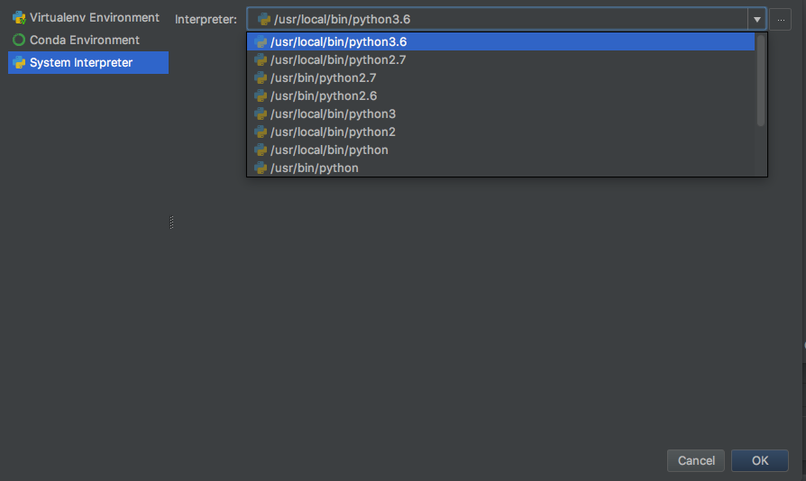

<!-- début résumé -->

Le but de ce tutoriel est d'installer une distribution python avec [anaconda](https://www.anaconda.com/) et l'IDE [pycharm](https://www.jetbrains.com/fr-fr/pycharm/). On suppose que vous avez déjà installé une distribution python avec anaconda.



Ce tutoriel est **vieux**. Il n'est peut-être plus à jour. J'utilise [vsc](../vsc-installation-et-prise-en-main){.interne} maintenant pour mes développements python.



<!-- fin résumé -->

## Pycharm

Commencez par [télécharger](https://www.jetbrains.com/fr-fr/pycharm/download) la version professionnels de *pycharm*. En temps qu'étudiant vous avez droit à une licence gratuite pendant 1an (renouvelable temps que vous êtes étudiant). Puis installez le logiciel.

### Lier anaconda et pycharm

Lorsque vous lancez `pycharm` une fenêtre de choix apparaît.

1. Créez un nouveau projet
2. une fenêtre apparaît, vous demandant quel type de projet vous voulez faire. Choisissez *pure Python* et à droite :
    * choisissez un dossier où vous mettrez votre projet
    * décochez la case *"Create a main.py welcome script"*
    * cliquez sur le triangle pour étendre la partie consacrée à l'interpréteur.
3. Dans la partie dédiée à l'interpréteur, vous voyez plusieurs choix. Nous allons utiliser un interpréteur existant (choisissez cette option) en cherchant le python d'anaconda. Pour cela :
    * cliquez sur les *"..."* à droite de la ligne de choix de l'interpréteur,
    * dans la nouvelle fenêtre, choisissez *Conda Environnement*. Il faut maintenant savoir où vous avez installé anaconda. En trouvant où se trouve votre interpréteur (voir [partie précédente](#anaconda-avec-un-terminal)) vous trouverez où se trouve anaconda
    * On a trois choses à faire : trouver l'interpréteur python, l'éxécutable anaconda et faire en sorte que pycharm se rappelle de tout ça.
    * interpréteur python. Il suffit de suivre [cette partie](#anaconda-avec-un-terminal). Pour mon mac `which python3` me rend : `/opt/anaconda3/bin/python3`
    * l'exécutable conda : c'est le début du chemin de l'interpréteur, jusqu'à `anaconda3`. (pour mon mac, à partir de la ligne précédente, j'en débuit qu'anaconda est dans le dossier : `/opt/anaconda3/`)
    * cochez la case *Make avaliable to all projects* pour que vous puissiez retrouver cet environnement à chaque nouveau projet.
    * cliquez sur le bouton *OK*
4. cliquez sur le bouton *Create* pour créer le projet avec notre nouvel environnement conda.

Une nouvelle fenêtre apparaît avec votre projet.


Il se peut que pycharm ne réponde pas bien au début. C'est normal, il est entrain d'analyser votre tout nouvel interpréteur python. Vous voyez une barre de progression en bas à droite qui vous indique ce qu'il fait. Laissez le finir d'indexer tout ça, cela peut durer un certain temps (surtout qu'anaconda a déjà plein de bibliothèque d'installées), mais il ne le fait que lorsque vous changez d'interpréteur.


Notre premier projet avec pycharm :

1. créons un fichier *file > new... > python file* et appelons le `main.py`{.fichier}
2. à gauche de la fenêtre vous voyez les différents fichiers et à droite des fichiers. Pour l'instant nous n'en avons qu'un seul et il est vide.
3. écrivez `print("Hello World")`{.language-} dans le fichier. Vous n'avez pas à vous préoccuper de sauver, *pycharm* le fait automatiquement.
4. exécuter votre code en allant dans le menu *Run > Run...*, une petite fenêtre s'affiche et choisissez `main.py`{.fichier}, c'est le fichier qui sera exécuté.
5. Regardez la fenêtre du bas de *pycharm* où vous voyez le résultat de votre programme.
  
Vous voyez maintenant en haut à droite de la fenêtre un endroit où est écrit *main* et à droite un petit triangle vert. Si vous glissez votre souris sur ce triangle vert vous voyez son raccourci clavier (sur mac c'est `ctrl + R`). Vous pouvez être n'importe où dans *pycharm*, en particulier sur d'autres fichiers, si vous cliquez sur le triangle vert ou si vous utilisez le raccourci clavier (qui correspond au menu *Run > Run*, sans les "..."), le fichier main sera exécuté.

Cela correspond à une configuration d'exécution. Ici *main* est le nom de la configuration d'exécution courante. On peut bien sur en créer d'autres, c'est ce qu'on fera lorsque l'on exécutera des tests, par exemple.

### Propriétés de pycharm

#### Aide en ligne

PyCharm est un éditeur professionnel, c'est normal que la prise en main soit plus complexe qu'avec un éditeur moins performant (comme notepad++ voir Sublime Text) ou scolaire (comme *Spyder*). En revanche, bien l'utiliser permet d'une part des gains de productivité importants et d'autre part de coder plus agréablement.

Le système d'aide de PyCharm est très complet et vous permet de vous familiariser mieux avec la bête. Il est disponible sur le site de l'éditeur : [aide Pycharm](https://www.jetbrains.com/help/pycharm/meet-pycharm.html).

#### Configurations d'exécution

Les configurations d'exécutions permettent d'exécuter des programmes ou des tests python. On les trouve soit grâce au menu *Run > edit configurations...*, ou en haut à droite de la fenêtre en cliquant sur le nom de la configuration courante (le nom à gauche du petit triangle vert).

Pour créer un nouvel environnement d'exécution :

* Ouvrez la fenêtre des contextes d'exécution dans le menu *Run > Edit configurations...*.
* La fenêtre qui s'est ouverte contient tous les contextes d'exécution de votre projet. Cliquez sur le *+* en haut à gauche de la fenêtre pour en créer un nouveau.
* Choisissez *python* si vous voulez exécuter du code ou *python tests* pour un framework de test. Paramétrez votre environnement en choisissant le script à exécuter (on pourra également nommer son environnement).
* Cliquez sur *OK* pour créer l'environnement.


Dans la fenêtre de gestion des contextes, ne modifiez pas les contextes par défaut. Ce sont des templates.


Pour plus d'informations, reportez vous à [la documentation de pycharm](https://www.jetbrains.com/help/pycharm/2016.3/working-with-run-debug-configurations.html?search=run).

#### L'interpréteur python d'un projet pycharm

Les préférences de pycharm sont accessibles via le menu *File > Settings...*. La fenêtre de préférences ressemble à ça :

On peut quasiment tout changer, de l'apparence à l'interpréteur en passant par les raccourcis clavier.


En haut à gauche se trouve un champ texte. Il permet de réduire les préférences à celles contenant le texte tapé (voir image ci-après).


L'interpréteur du projet se trouve dans la partie *Project* de la fenêtre des préférences.

Pour créer un nouvel interpréteur à partir de la fenêtre de l'interpréteur, il suffit de cliquer sur l'engrenage dans la partie réservée à l'interpréteur :

Si l'on veut ajouter un programme python déjà présent sur la machine, on choisit *Add...*.

Une nouvelle fenêtre s'affiche, qui doit ressembler à ça :

Attention, par défaut `virtualenv environment` (en haut à gauche de la fenêtre) est utilisé. Dans l'absolu c'est très bien mais pour nous ça va plus nous embêter qu'autre chose (en particulier il faudrait réinstaller numpy à chaque tp...). On choisi donc *Conda Environment* ou *system interpréteur*  et un python 3 d'installé :

Dans l'image ci-dessus, mon interpréteur python3 (python3.6) était dans le dossier `/usr/local/bin` (ce qui est souvent le cas dans le monde unix ou mac)

#### Installer des modules

On commence par aller trouver son interpréteur via le menu *File > Settings...* (je l'ai trouvé en tapant `interp` dans l'onglet de recherche) :

Les packages installé sont listé dans la fenêtre, avec le numéro de version installé et la dernière version disponible. Pour installer le package `numpy` on commence par cliquer sur le bouton `+` en bas à gauche de la fenêtre. Un zillion de package sont disponible. On cherche numpy :

On peut ensuite cliquer sur `install package` en bas à gauche pour installer le package.

#### Les raccourcis claviers

De nombreuses actions disponibles via un menu dans pycharm possèdent un raccourci clavier. 

Par exemple, sous unix :

* Commenter une ligne ou un bloc : *ctrl + /* (Utiliser la touche */* du pavé numérique)
* Rechercher : *ctrl + F*
* Exécuter la configuration d'exécution courante : *shift + F10*

L'utilisation des raccourcis clavier est décrite dans  l'aide en ligne de pycharm sur les [keymap](https://www.jetbrains.com/help/pycharm/keymap.html).
Si une commande possède un raccourci clavier, il est montré à droite de son nom :

L'image ci-dessus montre la commande *Rename* et son raccourci clavier *shift + F6* (cette commande est très très utile et vous l'utiliserez souvent car elle permet de renommer n'importe quoi. Le nom est modifié dans tout le fichier et dans d'autres fichiers du même projet).

Selon la plateforme, les raccourcis par défaut changent :

* [Raccourcis par défaut unix](https://resources.jetbrains.com/storage/products/pycharm/docs/PyCharm_ReferenceCard.pdf)
* [Raccourcis par défaut mac](https://resources.jetbrains.com/storage/products/pycharm/docs/PyCharm_ReferenceCard_mac.pdf)

Tous les raccourcis sont disponibles dans les préférences (menu *File > Settings...*) dans la partie keymap :

Le raccourci clavier pour commenter automatiquement une ligne ou une partie de texte sélectionné par défaut de *pycharm* n'est pas fonctionnel avec un clavier Français.

Le raccourci concerne les commentaires : *comment* en anglais. Pour trouver rapidement les raccourcis on tape donc *comment* dans la barre de recherche de la partie *keymap* de la fenêtre des paramètres :

 

Il y a 2 types de commentaires : commentaire d'une ligne et d'un bloc de texte. Certains langages utilisent ces deux types de commentaires (le C++ ou le Java par exemple), mais pas python puisqu'il suffit de mettre un `#` devant la ligne à commenter. Nous n'aurons à modifier que le raccourci : *Comment with Line Comment*.

Dans de nombreux éditeurs, ce raccourci est sur *ctrl + /* (`//` est le commentaire de ligne de nombreux langages comme le javascript, Java, C++, ...). C'est ce que pense faire *pycharm*, et ceci marche avec un clavier Américain. Le clavier Français a la touche */* comme modificateur de la touche `:`, ce qui confuse python.

Ajoutons donc le raccourci clavier qui consiste à taper simultanément sur *ctrl*, *shift* et *:*, c'est à dire la combinaison : *ctrl + shift + :* (sur mac, vous pouvez remplacer *ctrl* par *cmd* qui correspond mieux à l'usage courant sur cette plateforme).

Après avoir double cliqué sur la ligne *Comment with Line Comment* et choisi d'ajouter un raccourci clavier, effectuez la combinaison de touche puis cliquez sur *Ok* (appuyer sur *Entrée* change le raccourci...) :

Le raccourci est alors ajouté :


Testez le !

