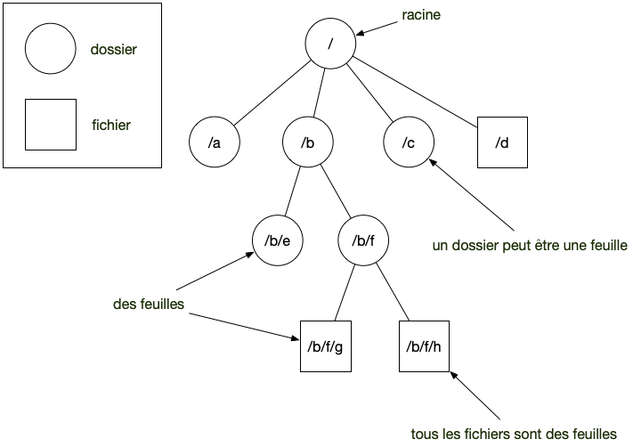


[Tutoriels]({{ ".." }}) / [{{title}}]({{ "." }})


<!-- début résumé -->

Qu'est-ce qu'un fichier ? Un dossier ? Comment naviguer dans un système de fichier avec le terminal ou l'explorateur de fichier.

<!-- fin résumé -->

## Système de fichier


Votre ordinateur est composé de ***fichiers*** et de ***dossiers*** (aussi appelé ***répertoire***) :

* un ***dossier*** est un conteneur qui peut contenir soit d'autres dossiers, soit des fichiers
* un ***fichier*** est ce que vous pouvez utiliser. C'est une image, du texte, ou encore un programme.

Il existe un dossier spécial, appelé ***racine*** qui est le départ : on peut atteindre tous les fichiers/dossiers de votre ordinateur à partir de celui-ci.


Cette organisation est appelée [arborescence de fichiers](https://fr.wikipedia.org/wiki/R%C3%A9pertoire_(informatique)) et ressemble à un [arbre enraciné](https://fr.wikipedia.org/wiki/Arbre_enracin%C3%A9) où les fichiers sont des feuilles, comme dans la figure ci-dessous :



### Exploration de l'arborescence

Chaque système d'exploitation fournit un outil pour naviguer dans l'arborescence des fichier. Nous nommerons cet outil **explorateur de fichiers**.


Ouvrez une fenêtre de l'explorateur de fichier et placez vous à la racine de votre système de fichier.



Sous Ubuntu, il  existe [plusieurs explorateurs de fichiers](https://doc.ubuntu-fr.org/gestionnaire_de_fichiers). Si vous êtes sous l'ide gnome, vous devriez avoir [nautilus](https://linuxpedia.fr/doku.php/premier_pas_nautilus) d'installé.

Pour aller à la racine, menu : *Aller à > emplacement...* puis choisissez `/`.


L'explorateur de fichier sous mac s'appelle [le finder](https://support.apple.com/fr-fr/HT201732). Ouvrez une nouvelle fenêtre du *Finder* et choisissez le mode d'affichage des fichiers en colonne. Ensuite, choisissez dans le menu : *aller > ordinateur* et cliquez sur *"Macintosh HD"*, qui est la racine de votre système de fichier.



L'[explorateur de fichier](https://support.microsoft.com/fr-fr/windows/rechercher-et-ouvrir-l-explorateur-de-fichiers-ef370130-1cca-9dc5-e0df-2f7416fe1cb1#WindowsVersion=Windows_10) permet de naviguer.

Le panel de gauche de l'explorateur permet d'aller à des endroit spécifiques de votre disque dur. Dans la partie *Ce PC*, vous devriez avoir un item nommé *Disque local (C:)* : c'est la racine.

Si vous cliquez sur la barre de chemin, vous voyez le chemin (si c'est pas un dossier spécial)



Vous pourrez ensuite naviguer de dossiers en dossiers, jusqu'à arriver à un fichier d'où vous ne pourrez plus avancer.

Dans l'exemple ci-après, j'ai navigué sur mon mac jusqu'à ma photo d'[Ada Lovelace](https://fr.wikipedia.org/wiki/Ada_Lovelace) :


On voit bien le chemin parcouru de la racine (appelé *"Macintosh HD"* sur un mac et le fichier).


Le nom des dossiers sur le disque dur et celui qui apparait dans l'explorateur de fichier peuvent être différents selon la langue du système d'exploitation.
Ainsi, le nom *Bureau* dans l'explorateur correspondra au dossier `Desktop` sur le disque dur.


### chemin { #absolu-relatif }

Le chemin vers un fichier depuis la racine s'écrit en séparant tous les dossiers parcourus par un `/`. Dans l'image de la navigation vers Ada Lovelace, son chemin est :

```shell
/Users/fbrucker/Desktop/ada_lovelace.png 
```

Tout fichier ou dossier de l'arborescence de fichiers possède un chemin unique depuis la racine, c'est donc un moyen de l'identifier.


Le chemin du dossier racine est `/`.


Un chemin qui commence par `/` est dit **chemin absolu**, puisqu'il part de la racine. On a aussi souvent coutume de parler de **chemin relatif** lorsqu'il part d'un dossier particulier. Dans l'exemple précédent, en partant du dossier `/Users/fbrucker`, le chemin relatif vers l'image d'Ada est : `Desktop/ada_lovelace.png`.


Un chemin absolu commence **toujours** par `/`. Un chemin qui ne commence **pas** par `/` est **toujours** un chemin relatif.

Le chemin absolu commence à la racine du disque dur, le chemin relatif commence au dossier **courant** (qui dépend du contexte)



Sous Windows, on utilise souvent `\` à la place de `/`.


### Plusieurs racines

On considère parfois que chaque disque dur, chaque clé usb constitue sa propre racine. Il y a alors une *racine des racines*, qui contient le départ vers les racines particulières des différents périphériques de stockages de l'ordinateur comme les disques durs, clés usb, etc.

C'est en réalité une vue de l'esprit. Il n'existe qu'une seule racine et chaque disque dur est [monté](https://fr.wikipedia.org/wiki/Point_de_montage).


Souvent sous windows ces racines sont explicites, c'est `c:` par exemple pour le disque dur principal.


### Dossiers `.` et `..` { #block-.-.. }

Les dossiers `.` et `..` sont des dossiers spéciaux qui signifient :

* le dossiers courant pour `.`
* le dossiers précédent du dossiers `.` pour `..`.

De là les 4 chemins suivants sont identiques :

* `/Users/fbrucker/Desktop/ada_lovelace.png`
* `/Users/fbrucker/./Desktop/./ada_lovelace.png`
* `/Users/fbrucker/../fbrucker/Desktop/ada_lovelace.png`
* `/Users/fbrucker/../fbrucker/./Desktop/ada_lovelace.png`


On fait souvent commencer un chemin relatif par `.` pour bien montrer sa différence par rapport à un chemin absolu qui commence par `/`.


L'intérêt principal de ces dossiers est qu'ils permettent de naviguer dans l'arborescence à partir d'un dossier. Par exemple dans un projet, si l'on n'utilise que des chemins relatifs, on pourra facilement déplacer le dossier du projet (voire le donner à une autre personne) sans casser les liens.


Dans un projet, utilisez **toujours** des chemins relatifs lorsque vous donnez des chemins, cela permet de déplacer le dossier sans casser les liens.


### Copier le chemin absolu



Dans l'explorateur de fichiers cliquez droit sur le dossier, puis copiez. Collez ensuite dans le terminal.




Dans le finder cliquez droit sur le dossier, puis copiez. Collez ensuite dans le terminal.




Dans explorateur de fichier cliquez sur le dossier, puis *copier le chemin d'accès* dans le menu *accueil*



### Maison

La *maison* est le dossier principal d'un utilisateur. C'est à partir de ce dossier qu'il pourra créer et ranger ses données.


Il est recommandé que ce dossier ne comporte ni espace ni accent.


### Dossiers spéciaux

Pour qu'un ordinateur fonctionne, il a besoin d'avoir des dossiers spéciaux contenant le système d'exploitation, les données, etc. Ces dossiers sont souvent [cachés](./#fichier-cache) et nécessitent d'être administrateur pour y accéder.

## Fichiers

### Extension de fichier

Un nom de fichier comporte souvent un texte, suivi d'un `.` puis de deux ou trois lettres qui forme une [*extension*](https://fr.wikipedia.org/wiki/Extension_de_nom_de_fichier).

Cette extension ne sert à rien pour l'ordinateur, c'est seulement une aide pour l'utilisateur et certaines applications. Cela permet à priori de catégoriser un fichier.

Ainsi, même si l'extension d'un fichier texte est *".txt"*, rien ne vous empêche de la changer en *".exe"* par exemple. Cela ne change en rien la nature du fichier. Cela cependant apporte de la confusion car certaines applications vont penser que c'est un fichier exécutable et cela va planter quand elles vont tenter de le faire. Enfin, dans un éditeur de texte, l'extension d'un fichier permet de charger une coloration syntaxique par défaut : *".py"* pour les fichiers python par exemple, *".md"* pour les fichier markdown.


Ne soyez pas créatifs dans les extensions de fichiers, utilisez celle par défaut selon le type de fichier que vous utilisez.


### Fichiers exécutables

Les fichiers exécutables sont **des programmes**, ils sont exécutés directement par le système d'exploitation. C'est ce qui fait qu'un exécutable windows ne peut pas être directement lancé sur un mac ou un linux, même s'ils ont le même processeur.


Un fichier python n'est **pas** un fichier exécutable. C'est un fichier texte qui est est lu — on dit **interprété** — par l'*interpréteur python* qui lui est un fichier exécutable.


## Dossiers et fichiers cachés { #fichier-cache }

Ce sont souvent des fichiers (ou des dossiers) de préférences. Ils sont invisible lorsque l'on regarde ces fichiers avec un explorateur de fichier.

Dans le monde linux/mac les fichiers cachés sont ceux qui commencent par un `.` et dans le monde windows, ils sont déterminés par une propriété. commencent  et

On peut cependant les afficher dans un explorateur de fichier en effectuant quelques manipulations :



[sous ubuntu](https://doc.ubuntu-fr.org/fichier_cache).




[dans le finder](https://www.ionos.fr/digitalguide/serveur/configuration/mac-afficher-les-fichiers-et-dossiers-caches/).


Pour que la manipulation de touche décrite dans la page fonctionne, il faut également d'appuyer sur la touche `fn` en plus.


Si vous voulez aller dans un dossier particulier, vous pouvez utiliser : *menu Aller > Aller au dossier...*




[afficher les dossiers cachés sous windows](https://support.microsoft.com/fr-fr/windows/voir-les-fichiers-et-les-dossiers-cach%C3%A9s-dans-windows-97fbc472-c603-9d90-91d0-1166d1d9f4b5)



## Ouvrir un terminal { #ouvrir-terminal }

Naviguer dans un système de fichier et exécuter des commandes est le but de l'[application terminal](../terminal-utilisation).

Vous pouvez facilement ouvrir un terminal dans le dossier voulu avec l'explorateur :



> TBD




Dans le finder cliquez droit sur le dossier, puis choisissez *"Nouveau terminal au dossier"* :




Plusieurs possibilités :

* Dans explorateur de fichier,  menu *"fichier > Ouvrir windows Powershell"*.
* Ou encore maintenir la touche `SHIFT` appuyée en cliquant droit sur le nom du dossier puis choisir *"Ouvrir la fenêtre powershell ici"*.


