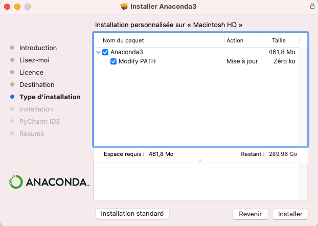


[Tutoriels]({{ ".." }}) / [{{title}}]({{ "." }})


<!-- début résumé -->

Comment installer la [distribution anaconda](https://www.anaconda.com/) de python.

<!-- fin résumé -->


Si vous cherchez un tutoriel pour général sur ce qu'est python et comment l'installer/utiliser : [installation python](../installation-python).


## Introduction

[Anaconda](https://www.anaconda.com/) est une entreprise gérant des distributions python orientées data science. L'intérêt d'une telle distribution est qu'elle regroupe et met à disposition de nombreuses bibliothèques. Le côté négatif est que l'on ne maîtrise pas les bibliothèques installées et l'installation de paquets supplémentaires est parfois problématique.

Cependant, pour une utilisation basique de python ou une utilisation via [Jupyter notebook](https://jupyter.org/), c'est une solution tout à fait satisfaisante car facile à mettre en œuvre sans être informaticien.

## Installation

Il existe plusieurs distributions de python anaconda. Nous allons utiliser l'[édition individuelle](https://www.anaconda.com/products/individual) qui est open source.


Si vous avez déjà une ancienne version d'anaconda et que vous souhaitez installer une mise à jour, il vous faudra commencer par supprimer [le dossier contenant l'ancienne version](#ou-est-anaconda).


### Installateur

 Téléchargez la version 64bit graphique correspondant à votre système d'installation, puis cliquez sur l'installeur.


Lorsque vous téléchargez l'installeur, Anaconda vous demandera de vous inscrire. Ce n'est pas nécessaire, pour obtenir l'installeur (il doit déjà être entrain de se télécharger).


### Installation de python


**Ne cliquez pas sur *suivant* comme des sauvages...** Lisez les choix qui vous sont proposés.


Lors de l'installation :



Après avoir accepté la licence d'utilisation, l'installateur vous demandera pour quoi vous voulez installer anaconda :

choisissez *installer sur un disque spécifique...* (ce n'est **pas** le choix par défaut) :

Puis choisissez votre disque dur (il doit s'(appeler *"Macintosh HD"*)). On peut maintenant cliquer sur le bouton *continuer*


Ceci n'est possible que si vous êtes administrateur de votre mac.


**Ne cliquez pas tout de suite sur installer** lorsque vous avez cette fenêtre :

Vous pouvez cliquer sur le bouton personnaliser si vous voulez que le python d'anaconda ne soit pas le python par défaut :

Si anaconda est votre principale installation de python (cela devrait être le cas si vous lisez cette doc), assurez vous que ces cases soient cochées.

On peut maintenant cliquer sur le bouton *installer* pour finaliser l'installation





Lors de votre installation, choisissez une installation pour tous les utilisateurs :

Juste avant l'installation, vous pourrez choisir des options. Cochez les deux, **même si c'est déconseillé** :



A la fin de l'installation vous devriez avoir un python qui fonctionne.

### Où est anaconda ? {#ou-est-anaconda}

Si vous avez suivi à la lettre le processus d'installation, anaconda devrait être installé :



Dans le dossier : `/opt/anaconda3`.

On ne le voit pas par défaut dans le finder, il faut aller directement au dossier en allant dans le *menu Aller > Aller au dossier...*, puis en tapant `/opt`.





Dans le dossier : `C:\programData\Anaconda3`.

Il faudra sûrement [révéler les fichiers cachés](../fichiers-navigation#dossiers-et-fichiers-cachés) pour voir le dossier dans un explorateur de fichier.



## Test de la distribution

Anaconda a installé des choses, en particulier l'application *Anaconda-Navigator* qui vous permet de lancer toutes les applications liées à Anaconda.


Le langage python est appelé : `python` sous windows et `python3` sous mac et linux


### Python avec Jupyter

Lancez l'application *Notebook* puis :

  1. créez un nouveau notebook `python` sous windows et `python3` sous mac et linux.
  2. dans la cellule tapez `print("Hello world!")`{.language-python}
  3. cliquez sur l'icône *Exécuter* sur la bannière de titre ou appuyer sur `shift + entrée`.
  
Vous devriez voir le texte `Hello World`{.language-python} en sortie de votre cellule.

### Python avec un terminal anaconda

Dans l'*anaconda navigator*, cliquez sur *Environnements* dans le menu de gauche (c'est le deuxième choix, après *Home* et avant *Learning*).

Vous devez avoir un unique environnement : *base (root)*. Un environnement est un interpréteur python et tous ses packages installés. On aura parfois envie de créer ses propres environnements pour installer soit une version spécifique de python, soit n'installer que certains packages.

Pour l'instant utilisons l'environnement de base. En cliquant sur le triangle vert à droite de l'environnement *base (root)*, vous pouvez cliquer sur *open terminal*, ce qui ouvrira un terminal. Une fois le terminal ouvert, remarquez qu'à gauche de l'invite de commande vous avez `(base)` d'écrit. Ceci montre quel environnement python vous avez.


Vous pouvez [connaître l'interpréteur](https://docs.anaconda.com/anaconda/user-guide/tasks/integration/python-path/).


Vous pouvez ensuite taper `python` sous windows et `python3` sous mac et linux pour entrer dans un [interpréteur python](../installation-de-python#interpréteur-id).

### Python avec un terminal normal

Ouvrez un [terminal](../terminal) et tapez `python` sous windows et `python3` sous mac et linux pour entrer dans un
[interpréteur python](installation-python#interpréteur-id).

## Installation de nouveaux modules

Anaconda vient avec de nombreux modules déjà installé. Si on veut en installer d'autres, il y a deux solutions :

* utiliser le gestionnaire de modules de python `python -m pip install <nom du module à installer>`
* utiliser [`conda`](https://conda.io/projects/conda/en/latest/user-guide/index.html) qui est le gestionnaire de modules spécifique à anaconda.


Si vous avez le choix, utilisez le gestionnaire de modules de python.

