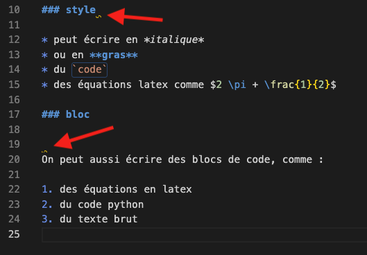


[Tutoriels]({{ ".." }}) / [{{title}}]({{ "." }})



* [Installation et prise en main de vsc](../vsc-installation-et-prise-en-main)



<!-- début résumé -->

Écrire et *compiler* du markdown avec vsc.

<!-- fin résumé -->

L'éditeur de texte [vscode](https://code.visualstudio.com/) permet d'écrire et d'exporter facilement du markdown.


Sa documentation comporte une [partie consacrée au markdown](https://code.visualstudio.com/docs/languages/markdown), n'hésitez pas à aller y jeter un coup d'œil.


## extensions markdown

Deux extensions sont très utiles pour écrire du markdown dans vscode :

* [Markdown All in One](https://marketplace.visualstudio.com/items?itemName=yzhang.markdown-all-in-one) qui permet de fluidifier l'écriture de markdown et permet un export de celui-ci en html.
* [markdownlint](https://marketplace.visualstudio.com/items?itemName=DavidAnson.vscode-markdownlint), un [linter](https://mindsers.blog/fr/post/linting-good-practices/) qui souligne en jaune les fautes de style de markdown (saut dans la hiérarchie des sections par exemple) pour que vous puissiez les corriger et écrire parfaitement du markdown


Installez les deux extensions ci-dessus dans votre vscode.


## exemple {#exemple}

### fichier markdown


Dans vscode, créez un nouveau fichier que vous appellerez *"exemple.md"* (*".md"* est l'extension par défaut des fichiers markdown).

Copiez/collez-y- le texte ci-dessous et sauvez le fichier.


```text

# Un petit peu de Markdown

## quoi ?

Le [Markdown](https://fr.wikipedia.org/wiki/Markdown) est un format texte éditable et visualisable dans tout éditeur.

## comment ?

### style

* peut écrire en *italique*
* ou en **gras**
* du `code`
* des équations latex comme $2 \pi + \frac{1}{2}$

### bloc

On peut aussi écrire des blocs de code, comme :

1. des équations en latex
2. du code python
3. du texte brut

```

Le texte ci-dessus est un petit panel de ce qu'on peut faire en markdown. Il montre en particulier comment on peut représenter :

* des sections
* des liste ordonnées ou non
* du style (italique, gras, code, équations)

Vous voyez que ce format est *lisible* directement dans vscode (on comprend qu'un titre est un titre par exemple).

### linter

L'intérêt de l'extension [markdownlint](https://marketplace.visualstudio.com/items?itemName=DavidAnson.vscode-markdownlint) est qu'elle souligne les fautes de style. Il ne devrait pas y en avoir dans l'exemple précédent. Ajoutons en :



* ajoutez un espace à la fin d'un titre
* sautez deux ligne après un titre



Vous devriez voir apparaître des marques jaunes, comme sur l'image ci-dessous :



Pour connaître la raison de la mise en garde, passer votre curseur dessus :


Plus d'un saut de ligne après un titre est considéré comme une faute de style.



Corrigez les fautes de style pur ne plus avoir de marques jaunes.



## export en html

Si le markdown est pratique pour être écrit et lu rapidement, pour de long documents ou le partage de ceux-ci, il est important de les exporter dans un format comme le html.

Avec le plugin *Markdown All in One* de vscode, il suffit de taper la commande :

```text
markdown All in One: Print current document to HTML
```

dans la [palette de commande](../vsc-installation-et-prise-en-main#palette-de-commande) (que l'on peut copier/coller). Ceci va créer un fichier html contenant votre code markdown *compilé* dans le même dossier que le fichier markdown.


Dans vscode, en ayant comme onglet actif celui contenant le fichier *"exemple.md"*, ouvrez la [palette de commande](../vsc-installation-et-prise-en-main#palette-de-commande) et taper la commande `markdown All in One: Print current document to HTML`.


Après l'exécution de cette commande, vous aurez un fichier *"exemple.html"* dans le même dossier que votre fichier *"exemple.md"*.



Ouvrez le fichier *"exemple.html"* dans votre navigateur favori pour voir le résultat.


