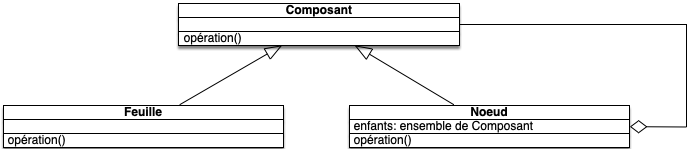

Partie 3/3.

<!--more-->

> [Algorithme, code et théorie]() / [code]() / [programmation objet]() / [projet : TDD]() / [partie 3/3]()
>
> **prérequis :**
>
> * [partie 2/3]()
>
{.chemin}

## todo list initiale

* [ ] \\$5 + 2.5CHF = \\$10 si le taux de change est 1:.5
* [ ] gestion des arrondis (lorsque les montants seront des réels)
* [ ] `== None`
* [ ] `==` avec autre chose qu'un `Dollar`

On est arrivé à un point clé de notre projet. La classe `Monnaie` permet de gérer plusieurs devises et de multiplier les montant par un entier.

On va encore épurer la todo list en supprimant les améliorations possibles de `==` et la gestion des arrondis (que l'on vous laisse en exercice :-)) :

* [ ] \\$5 + 2.5CHF = \\$10 si le taux de change est 1:.5

## Déroulé

On va dans cette partie vous laisser plus libre et moins détailler les étapes. Ce sera à vous de modifier petit à petit votre code et à lancer les tests autant de de fois que nécessaire.

Nous allons ici faire en sorte que l'on puisse additionner des devises ensemble et gérer le taux de change. Cela va nécessiter l'utilisation de design patterns adaptés.

Rappelez vous (et forcez vous à le faire jusqu'à ce que ça devienne un automatisme) que l'on écrit **d'abord** le test, puis que l'on code **après** : on ne code que sur du **vert**, il n'y a **aucune** exception.

> **Principe du TDD :**
>
> 1. **rouge** :
>    * écrire *rapidement* un *petit* test
>    * lancer les tests et les voir planter, voir même  ne correspondre à aucun code.
> 2. **vert** :
>    * écrire le code *minimal* qui permet de faire passer le test
>    * lancer les tests et les voir tous réussir
> 3. **code/refactor** :
>    * élimine les duplications tout en conservant la validité des tests.
>
> La partie refactor, qui est la partie réelle où l'on code ne se fait **que sur du vert** : on est assuré de ne pas casser le code puisque les tests passent.
{.note}

## Addition 1/3

Avant de traiter l'addition de deux monnaies différentes, commençons par traiter le cas de 1 unique monnaie.

### todo list {#todo-list-add-1-1}

* [ ] \\$5 + 2.5CHF = \\$10 si le taux de change est 1:.5
* **[-] \\$5 + \\$2 = \\$7**

On s'assure dans le test qu'on ne somme pas deux fois la même chose pour éviter des effets de bord possible dans le code (c'est du code smell).

### faire {#faire-add-1-1}

> Ecrivez un test permettant de tester que \\$5 + \\$2 = \\$7 en :
>
> * utilisant la méthode `plus` de `Monnaie` qui prend une autre monnaie en paramètre et rend une monnaie
>
> * les objets de `Monnaie` sont toujours non mutable
{.a-faire}

Une fois les tests écris, une *obvious implementation* devrait faire l'affaire.


*"test_monnaie.py"* :

```python
# ...

def test_plus():
    assert monnaie.dollar(7) == monnaie.dollar(5).plus(monnaie.dollar(2))

# ...
```

*"monnaie.py"* :

```python
# ...

class Monnaie:
    # ...

    def plus(self, other):
        return Monnaie(self.montant + other.montant, self.devise)

    # ...

# ...
```



### faire {#faire-add-1-2}

Rendons les choses jolies en utilisant `__add__` qui est le pendant pour l'addition de `__mul__`

> Remplacez la méthode `plus` par `__add__`dans `Monnaie`.
{.a-faire}


easy peasy, on remplace juste `plus` par `+`

*"test_monnaie.py"* :

```python
# ...

def test_plus():
    assert monnaie.dollar(7) == monnaie.dollar(5) + monnaie.dollar(2)

# ...
```

et  `plus` par `__add__`

*"monnaie.py"* :

```python
# ...

class Monnaie:
    # ...

    def __add__(self, other):
        return Monnaie(self.montant + other.montant, self.devise)

    # ...

# ...
```



### todo list {#todo-list-add-1-2}

* [ ] \\$5 + 2.5CHF = \\$10 si le taux de change est 1:.5
* [X] \\$5 + \\$2 = \\$7

## Addition 2/3

Notre implémentation de `+` qui rend un objet de type `Mnnaie` ne sera pas tenable longtemps.

En effet `$5 + 2.5CHF` **ne peut pas être** un objet de type `Monnaie`. Ce sont en effet deux devises différentes dont la valeur va dépendre d'un cours [qui change au cours du temps](https://fr.tradingview.com/symbols/USDCHF/). La somme `$5 + 2.5CHF` peut ainsi valoir `$10` en 2022 et `$7` en 2034.

Il faut donc résoudre deux problèmes :

* comment stocker une somme sous la forme de plusieurs devises ?
* comment convertir une monnaie ou un ensemble de monnaies en une autre ?

### todo list {#todo-list-add-2-1}

* [ ] \\$5 + 2.5CHF = \\$10 si le taux de change est 1:.5
* **[-] \\$5 + \\$2 = quelque chose qui correspond à $7**

### faire {#faire-add-2-1}

Pour imaginer cela rien de mieux qu'un test ! On va l'écrire à l'envers, en partant du résultat, car  on sait où on veut arriver : à $10 :

```python
### ...

def test_conversion_addition():
    # ...
    
    assert monnaie.dollar(7) == conversion

# ...
```

Ces $10 viennent d'une conversion en dollar d'une somme de deux monnaies, conversion qui -- d'un point de vue métier -- ne peut venir que d'une banque :

```python
### ...

def test_conversion_addition():
    # ...
    
    conversion = banque.conversion(somme, "USD")

    assert monnaie.dollar(7) == conversion

# ...
```

Banque qu'il faut créer :

```python
### ...

def test_conversion_addition():
    # ...
    
    banque = monnaie.Banque()
    conversion = banque.conversion(somme, "USD")

    assert monnaie.dollar(7) == conversion

# ...
```

Il ne reste plus qu'à fabriquer notre expression pur avoir notre test final :

```python
### ...

def test_conversion_addition():
    somme = monnaie.dollar(5) + monnaie.dollar(2)
    banque = monnaie.Banque()
    conversion = banque.conversion(somme, "USD")

    assert monnaie.dollar(7) == conversion

# ...
```

> Ajoutez le test dans *"test_monnaie.py"* et fakez le tout dans *"monnaie.py"*  pour que le test passe.
{.a-faire}


*"monnaie.py"* :

```python
# ...

class Banque:
    def conversion(self, expression, currency):
        return dollar(7)

# ...
```



## Addition 3/3

L'implémentation réelle de tout ce qu'on a *faké* n'est pas si évidente que ça. On va donc devoir faire des choix restrictifs et ajouter à la todo list les généralisations à effectuer pour terminer le travail.

On va considérer que toute somme de deux monnaies est une nouvelle classe `Somme` (on va cependant ajouter que la somme de 2 monnaies identiques devrait rendre une monnaie, comme pour la multiplication,  dans la todo list).

### todo list {#todo-list-add-3-1}

On change notre iitem de la todo list puique \\$5 + \\$2 ne sera plus égal à \\$7, mais que ce serait bien qu'il soit :

* [ ] \\$5 + 2.5CHF = \\$10 si le taux de change est 1:.5
* [ ] \\$5 + \\$2 doit être égal à \\$7
* **[-] \\$5 + \\$2 = quelque chose qui correspond à $7**

### faire {#faire-add-3-1}

> 1. supprimez le test `test_plus` qui vérifie que \\$5 + \\$2 = \\$7 ce qui n'est plus vrai
> 2. on ajoute un test pour montrer que la somme de deux monnaies est un objet contenant une partie gauche (la partie à gauche du `+`) et une partie droite (la partie à droite du `+`)
> 3. on implémente le tout en une petite *obvious implementation*
{.a-faire}


*"test_monnaie.py"* :

```python
# ...

def test_plus_est_une_Somme():
    somme = monnaie.dollar(5) + monnaie.dollar(2)

    assert somme.gauche == monnaie.dollar(5)
    assert somme.droite == monnaie.dollar(2)

# ...
```

*"monnaie.py"* :

```python
# ...

class Somme:
    def __init__(self, gauche, droite):
        self.gauche = gauche
        self.droite = droite

# ... 

class Monnaie:
    # ...

    def __add__(self, other):
        return Somme(self, other)

    # ...

# ...
```



### todo list {#todo-list-add-3-2}

On a pas fini notre item.

* [ ] \\$5 + 2.5CHF = \\$10 si le taux de change est 1:.5
* [ ] \\$5 + \\$2 doit être égal à \\$7
* **[-] \\$5 + \\$2 = quelque chose qui correspond à $7**

Mais on a bien avancé puisque  \\$5 + \\$2 n'est plus une `Monnaie`. Il nous reste à faire en sorte que ce quelque chose corresponde à \\$7.

## conversion 1/3

Pour que \\$5 + \\$2 corresponde à quelque chose qui vaut à \\$7, on doit travailler sur la méthode `conversion` de la `Banque`. C'est elle qui doit pouvoir faire le change (pour l'instant c'est un *fake* qui rend \\$7).

### todo list {#todo-list-conv-1-2}

Pour l'instant, `Banque.conversion` prend pour une `Somme` en paramètre. Nous n'allons pas ous en occuper tout de suite, mais il pourrait être intéressant qu'elle puisse aussi prendre une `Monnaie` en paramètre pour faire le change :

* [ ] \\$5 + 2.5CHF = \\$10 si le taux de change est 1:.5
* [ ] \\$5 + \\$2 doit être égal à \\$7
* **[-] \\$5 + \\$2 = quelque chose qui correspond à $7**
* [ ] `Banque.conversion(Monnaie)`

### faire {#faire-conv-1-1}

Le test `test_conversion_addition` affirme que `banque.conversion(monnaie.dollar(5) + monaie.dollar(2), "USD")` vaut  `monnaie.dollar(7)`. Mais n'otre implémentation est encore un fake (il reste plein de duplications.

> Supprimer les duplication de la méthode `Banque.conversion` en :
>
> * supposant que les parties `gauche` et `droite` de la somme sont des `Monnaie`
> * que le taux de change est toujours de 1 pour 1
{.a-faire}


*"monnaie.py"* :

```python
# ...

class Banque:
    def conversion(self, expression, devise):
        return Monnaie(expression.gauche.montant + expression.droite.montant, devise)

# ...
```



C'est un début. Il nous reste à gérer :

* lorsque les deux parties de la `Somme` ne sont pas des `Monnaie`
* le taux de change

## conversion 2/3

L'implémentation actuelle de la méthode `Banque.conversion` — même si incomplète — pose déjà des soucis. En particulier : la banque doit connaître l'implémentation de `Monnaie` pour avoir accès à l'attribut `montant`.

Lorsque l'on fait du développement objet, on aime pas trop que tous les objets conaissent les attributs de tout le monde. Cela couple les objets entre eux et le code en devient moins maniable (en changeant une classe, il faut changer toutes les autres...)

> **Principe de développement objet :** [loi de Déméter](https://fr.wikipedia.org/wiki/Loi_de_D%C3%A9m%C3%A9ter)
>
> Toute méthode `m` d'un objet `o` de classe `C` ne peut invoquer que :
>
> * les paramètres de `m`
> * les objets créés par `m`
> * lui-même
> * les méthodes de `C`
>
> Un bon programme utilise des objets qui interagissent entre eux mais qui ne connaissent pas l'implémentation des autres classes. Les objets doivent être le plus découplé possible.
{.note}

En particulier, la loi de Déméter demande d'éviter d'appeler les méthodes d'un attribut d'un objet ce qui est exactement ce que l'on fait.

### faire {#faire-conv-2-1}

Pour éviter cette double indirection :

> Remontez d'un cran le code de `Banque.conversion` en le plaçant dans une méthode `Somme.conversion(devise)`. Pour l'instant on suppose toujours que le taux de conversion est de 1 pour 1 quelque soient les monnaies et que les parties gauche et droite des `Somme` sont des `Monnaies`.
{.a-faire}


*"monnaie.py"* :

```python
# ...

class Banque:
    def conversion(self, expression, devise):
        return expression.conversion(devise)

# ...

class Somme:
    # ... 

    def conversion(self, devise):
        return Monnaie(self.gauche.montant + self.droite.montant, devise)

    # ... 

# ...
```



### todo list {#todo-list-conv-2-1}

On a fini un item, mais avec plein de restrictions. Ajoutons les à la la todo list.

* [ ] \\$5 + 2.5CHF = \\$10 si le taux de change est 1:.5
* [ ] \\$5 + \\$2 doit être égal à \\$7
* [X] \\$5 + \\$2 = quelque chose qui correspond à $7
* [ ] `Banque.conversion(Monnaie)`
* [ ] `Somme.conversion(devise)` doit vraiment faire des conversions

## conversion 3/3

L'étape précédente a permis de baisser le niveau de connaissance de la banque des objets qui l'entourent. C'est une bonne chose car cela suit la loi de Déméter.

Monter la méthode `conversion` de la `Banque` à la `Somme` nous permet également de traiter le cas où `Banque.reducconversiontion` a une  `Monnaie` comme paramètre : il suffit de rajouter une méthode `Monnaie.conversion` !

### todo list {#todo-list-conv-3-1}

* [ ] \\$5 + 2.5CHF = \\$10 si le taux de change est 1:.5
* [ ] \\$5 + \\$2 doit être égal à \\$7
* [X] \\$5 + \\$2 = quelque chose qui correspond à $7
* **[-] `Banque.conversion(Monnaie)`**
* [ ] `Somme.conversion(devise)` doit vraiment faire des conversions

### faire {#faire-conv-3-1}

> 1. créez un test où l'argument de `Banque.conversion` est un objet de type `Monnaie`
> 2. implémentez le code correspondant
>
> De même que précédemment, on va considérer que le seul paramètre de la méthode `Monnaie.conversion` la devise d'arrivée et que — pour l'instant — le taux de change est de 1 pour 1
{.a-faire}


*"test_monnaie.py"* :

```python
# ...

def test_banque_conversion_monnaie_identique():
    banque = monnaie.Banque()
    assert monnaie.dollar(1) == banque.conversion(monnaie.dollar(1), "USD")

# ...
```

*"monnaie.py"* :

```python
# ...

class Monnaie:
    # ...

    def conversion(self, devise):
        return Monnaie(self.montant, devise)

    # ...

# ...
```



### todo list {#todo-list-conv-3-2}

On a fini un item, mais avec plein de restrictions. Ajoutons les à la la todo list :

* [ ] \\$5 + 2.5CHF = \\$10 si le taux de change est 1:.5
* [ ] \\$5 + \\$2 doit être égal à \\$7
* [X] \\$5 + \\$2 = quelque chose qui correspond à $7
* [X] `Banque.conversion(Monnaie)`
* [ ] `Somme.conversion(devise)` doit vraiment faire des conversions
* [ ] `Monnaie.conversion(devise)` doit vraiment faire des conversions

## Taux de change 1/2

On va maintenant s'attaquer à la conversion. Commençons simple avec les objets de type `Monnaie`

### todo list {#todo-list-change-1-1}

* [ ] \\$5 + 2.5CHF = \\$10 si le taux de change est 1:.5
* [ ] \\$5 + \\$2 doit être égal à \\$7
* [X] \\$5 + \\$2 = quelque chose qui correspond à $7
* [X] `Banque.conversion(Monnaie)`
* [ ] `Somme.conversion(devise)` doit vraiment faire des conversions
* **[-] `Monnaie.conversion(devise)` doit vraiment faire des conversions**

### faire {#faire-change-1-1}

> On veut que `Banque.conversion(monnaie.dollar(2), "CHF")` donne 1. On doit pour cela utilisez un taux de change donné par `Banque.change` qui prend 2 devises en paramètres, celle de départ et celle d'arrivée.
>
> 1. créez un test qui vérifie que `Banque.change` fonctionne pour deux devises identiques et utilisez cette méthode dans `Banque.conversion`.
> 2. créez un test qui vérifie que `Banque.change` fonctionne pour convertir des dollar en CHF avec un taux de 2 dollars pour 1 CHF.
> 3. créez un test qui vérifie que `Banque.conversion(monnaie.dollar(2), "CHF")` donne 1
> 4. utilisez la banque pour faire la conversion dans `Monnaie.conversion` (il faudra ajouter la banque comme paramètre)
{.a-faire}


*"test_monnaie.py"* :

```python
# ...

def test_banque_change_identique():
    assert 1 == monnaie.Banque().change("USD", "USD")


def test_banque_change_CHF_dollar():
    assert 2 == monnaie.Banque().change("CHF", "USD")
    assert 0.5 == approx(monnaie.Banque().change("USD", "CHF"))

# ...

def test_banque_conversion_monnaie_differente():
    banque = monnaie.Banque()
    assert monnaie.franc(1) == banque.conversion(monnaie.dollar(2), "CHF")

# ...
```

*"monnaie.py"* :

```python
# ...

class Banque:
    def conversion(self, expression, devise):
        return expression.conversion(self, devise)

    def change(self, devise_depart, devise_arrivee):
        if devise_depart == devise_arrivee:
            return 1
        elif devise_depart == "USD":
            return .5
        else:
            return 2

# ... 

class Somme:
    # ...

    def conversion(self, banque, devise):
        return Monnaie(self.gauche.montant + self.droite.montant, devise)

    # ...

# ...

class Monnaie:
    # ...

    def conversion(self, banque, devise):
        return Monnaie(self.montant * banque.change(self.devise, devise), devise)

    # ...

# ...
```

Remarquez qu'on a du également modifier `Somme.conversion` pour que les tests continuent de passer.



### todo list {#todo-list-change-1-2}

* [ ] \\$5 + 2.5CHF = \\$10 si le taux de change est 1:.5
* [ ] \\$5 + \\$2 doit être égal à \\$7
* [X] \\$5 + \\$2 = quelque chose qui correspond à $7
* [X] `Banque.conversion(Monnaie)`
* [ ] `Somme.conversion(devise)` doit vraiment faire des conversions
* [X] `Monnaie.conversion(devise)` doit vraiment faire des conversions

### Taux de change 2/2

Pour l'instant notre conversion pour les sommes ne considère que les mêmes devises. On va travailler maintenant sur des devises différentes.

### todo list {#todo-list-change-2-1}

* [ ] \\$5 + 2.5CHF = \\$10 si le taux de change est 1:.5
* [ ] \\$5 + \\$2 doit être égal à \\$7
* [X] \\$5 + \\$2 = quelque chose qui correspond à $7
* [X] `Banque.conversion(Monnaie)`
* **[-] `Somme.conversion(devise)` doit vraiment faire des conversions**
* [X] `Monnaie.conversion(devise)` doit vraiment faire des conversions

### faire {#faire-change-2-1}

Commençons simplement :

> Faire un test qui convertit la somme de \\$2 et 1CHF en franc suisse et implémentez le tout.
{.a-faire}


*"test_monnaie.py"* :

```python
# ...

def test_somme_conversion_deux_monnaies():
    assert monnaie.franc(2) == monnaie.Banque().conversion(monnaie.dollar(2) + monnaie.franc(1), "CHF")

# ...
```

*"monnaie.py"* :

```python
# ...

class Somme:
    # ...

    def conversion(self, banque, devise):
        gauche = banque.conversion(self.gauche, devise)
        droite = banque.conversion(self.droite, devise)
        return Monnaie(gauche.montant + droite.montant, devise)

    # ...

# ...

class Monnaie:
    # ...

    def conversion(self, banque, devise):
        return Monnaie(self.montant * banque.change(self.devise, devise), devise)

    # ...

# ...
```

Remarquez qu'on a du également modifier `Somme.conversion` pour que les tests continuent de passer.



### todo list {#todo-list-change-2-2}

* [X] \\$5 + 2.5CHF = \\$10 si le taux de change est 1:.5
* [ ] \\$5 + \\$2 doit être égal à \\$7
* [X] \\$5 + \\$2 = quelque chose qui correspond à $7
* [X] `Banque.conversion(Monnaie)`
* [X] `Somme.conversion(devise)` doit vraiment faire des conversions**
* [X] `Monnaie.conversion(devise)` doit vraiment faire des conversions

## Expressions

Pour finir, il nous reste à généraliser le tout. C'est à dire que l'on aimerait bien pouvoir multiplier une `Somme` par un entier par exemple ou additionner des `Somme` entre elles.

Le design pattern utilisé pour cela est :

> **design pattern :** [composite](https://refactoring.guru/fr/design-patterns/composite)
>
> Son but est de pouvoir traiter un groupe d'individu comme un seul. Il utilise une structuration récursive pour cela.
{.note}

Le diagramme de classe du pattern composite peut -être vu comme ça :

{:style="margin: auto;display: block"}

Un noeud va être composé d'autre noeud ou de feuilles, les deux classes ayant une méthode `opération`. La méthode `opération` de la classe noeud consistant uniquement à successivement appeler la méthode `opérations` pour chacun de ses enfants. La terminaison intervenant lorsqu'est appelé la méthode opération d'une feuille.

L'intérêt principal de ce design pattern est que la façon d'appeler la méthode `opération` est identique pour un ensemble ou un unique élément.

### faire {#faire-exp-1}

A priori, une partie de la somme de sommes est déjà implémentée. Regardez comment `Somme` est construite, en particulier la méthode `__add__`.

Par exemple, le test suivant doit passer :

*"test_monnaie.py"* :

```python
# ...

def test_somme_de_somme():
    banque = monnaie.Banque()
    expression = monnaie.dollar(1) + (monnaie.franc(2) + monnaie.dollar(1))
    assert monnaie.franc(3) == banque.conversion(expression, "CHF")

# ...
```

> pourquoi ?
{.a-faire}


La méthode conversion est récursive dans `Somme`. Les terminaison se faisant lorsque une partie de la somme est une `Monnaie`.



En revanche, ce test ne passe pas encore :

*"test_monnaie.py"* :

```python
# ...

def test_somme_de_somme_2():
    banque = monnaie.Banque()
    expression = (monnaie.dollar(1) + monnaie.franc(2)) + monnaie.dollar(1)
    assert monnaie.franc(3) == banque.conversion(expression, "CHF")

# ...
```

> pourquoi ?
{.a-faire}


Le résultat des tests donne :

```text

    def test_somme_de_somme_2():
        banque = monnaie.Banque()
>       expression = (monnaie.dollar(1) + monnaie.franc(2)) + monnaie.dollar(1)
E       TypeError: unsupported operand type(s) for +: 'Somme' and 'Monnaie'
```

Nous n'avons pas implémenté de méthode `__add__` pour les `Somme`.


> Faite passer les tests.
{.a-faire}


*"monnaie.py"* :

```python
# ...

class Somme:
    # ...

    def __add__(self, other):
        return Somme(self, other)

    # ...

# ...
```



### faire {#faire-exp-2}

Il ne reste plus qu'à tester la multiplication pour finir.

*"test_monnaie.py"* :

```python
def test_mult_de_somme():
    banque = monnaie.Banque()

    expression = (monnaie.franc(2) + monnaie.dollar(1)) * 4
    assert monnaie.franc(10) == banque.conversion(expression, "CHF")
```

> Faite passer le test ci-dessus
{.a-faire}


*"monnaie.py"* :

```python
# ...

class Somme:
    # ...

    def __mul__(self, multiplier):
        return Somme(self.gauche * multiplier, self.droite * multiplier)
    
    # ...

# ...
```



> Pourquoi nous sera-t-il impossible d'écrire : `4 * (monnaie.franc(2) + monnaie.dollar(1))` ?
{.a-faire}


Parce qu'il faudrait modifier la méthode `__mul__` des entiers de python, ce qui est impossible.



## bilan

Vous avez suivi tout un projet de développement par les tests. J'espère vous avoir convaincu que cette méthode permet de développer rapidement et proprement du code (*"clean code that works*").

### code

#### *"test_monnaie.py"*

```python
from pytest import approx
import monnaie


def test_multiplication():
    cinq = monnaie.dollar(5)

    assert monnaie.dollar(10) == cinq * 2
    assert monnaie.dollar(15) == cinq * 3


def test_egalite():
    assert monnaie.dollar(5) == monnaie.dollar(5)


def test_non_egalite_dollar():
    assert monnaie.dollar(5) != monnaie.dollar(6)


def test_franc_dollar():
    assert monnaie.franc(1) != monnaie.dollar(1)


def test_devise():
    assert "USD" == monnaie.dollar(1).devise
    assert "CHF" == monnaie.franc(1).devise


def test_plus_est_une_Somme():
    somme = monnaie.dollar(5) + monnaie.dollar(2)

    assert somme.gauche == monnaie.dollar(5)
    assert somme.droite == monnaie.dollar(2)


def test_conversion_addition():
    somme = monnaie.dollar(5) + monnaie.dollar(2)
    banque = monnaie.Banque()
    conversion = banque.conversion(somme, "USD")

    assert monnaie.dollar(7) == conversion


def test_banque_conversion_monnaie_identique():
    banque = monnaie.Banque()
    assert monnaie.dollar(1) == banque.conversion(monnaie.dollar(1), "USD")


def test_banque_conversion_monnaie_differente():
    banque = monnaie.Banque()
    assert monnaie.franc(1) == banque.conversion(monnaie.dollar(2), "CHF")


def test_banque_change_identique():
    assert 1 == monnaie.Banque().change("USD", "USD")


def test_banque_change_CHF_dollar():
    assert 2 == monnaie.Banque().change("CHF", "USD")
    assert 0.5 == approx(monnaie.Banque().change("USD", "CHF"))


def test_somme_conversion_deux_monnaies():
    assert monnaie.franc(2) == monnaie.Banque().conversion(
        monnaie.dollar(2) + monnaie.franc(1), "CHF"
    )


def test_somme_de_somme():
    banque = monnaie.Banque()
    expression = monnaie.dollar(1) + (monnaie.franc(2) + monnaie.dollar(1))
    assert monnaie.franc(3) == banque.conversion(expression, "CHF")


def test_somme_de_somme_2():
    banque = monnaie.Banque()
    expression = (monnaie.dollar(1) + monnaie.franc(2)) + monnaie.dollar(1)
    assert monnaie.franc(3) == banque.conversion(expression, "CHF")


def test_mult_de_somme():
    banque = monnaie.Banque()

    expression = (monnaie.franc(2) + monnaie.dollar(1)) * 4
    assert monnaie.franc(10) == banque.conversion(expression, "CHF")

```

#### *"monnaie.py"*

```python
def dollar(montant):
    return Monnaie(montant, "USD")


def franc(montant):
    return Monnaie(montant, "CHF")


class Monnaie:
    def __init__(self, montant, devise):
        self.montant = montant
        self.devise = devise

    def __eq__(self, other):
        return self.devise == other.devise and self.montant == other.montant

    def __mul__(self, multiplicateur):
        return Monnaie(self.montant * multiplicateur, self.devise)

    def __add__(self, other):
        return Somme(self, other)

    def conversion(self, banque, devise):
        return Monnaie(self.montant * banque.change(self.devise, devise), devise)


class Banque:
    def conversion(self, expression, devise):
        return expression.conversion(self, devise)

    def change(self, devise_depart, devise_arrivee):
        if devise_depart == devise_arrivee:
            return 1
        elif devise_depart == "USD":
            return 0.5
        else:
            return 2


class Somme:
    def __init__(self, gauche, droite):
        self.gauche = gauche
        self.droite = droite

    def conversion(self, banque, devise):
        gauche = banque.conversion(self.gauche, devise)
        droite = banque.conversion(self.droite, devise)
        return Monnaie(gauche.montant + droite.montant, devise)

    def __add__(self, other):
        return Somme(self, other)

    def __mul__(self, multiplier):
        return Somme(self.gauche * multiplier, self.droite * multiplier)

```
